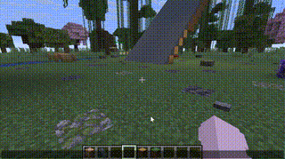
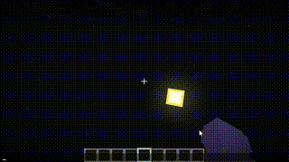

# VVE 3.0 使用文档

VVE（Vanilla Vehicle Engine）是面向原版 Minecraft 的高性能物理引擎数据包。

| 项目 | 信息 |
| --- | --- |
| 适用版本 | Minecraft 1.21.5 ~ 26.2 |
| 前置依赖 | `math3.1`、`math3.1_lalib`、`math3.1_gelib` |
| 命名空间 | `vve`、`vve_examples`、`module_control` |

**快速导航：** [基本介绍](#1-基本介绍) · [安装方法](#2-安装方法) · [快速开始](#3-快速开始) · [常用接口](#4-常用接口介绍) · [文档导航](#5-文档导航) · [项目历史](#6-项目历史)

---

| 载具与斜面 | 五方偏方面体 |
| :---: | :---: |
|  |  |

## 1. 基本介绍

### 什么是 VVE？

VVE（Vanilla Vehicle Engine）是一款由小豆 8593（游戏 ID：`xiaodou123`）开发的原版 Minecraft 物理引擎数据包，以性能和实用性为主。

VVE 1 与 VVE 2 的诞生过程请查看[项目历史](#6-项目历史)。

随着近些年作者逐步建立原版 Minecraft 性能理论，并进行了越来越多的性能测试，作者决定开发一个整合前两代经验的 VVE 3 引擎。

VVE 3 实现了对性能的精准把控，最多可以支持上百个物体实时运行。在功能上，VVE 既可以模拟载具，也可以模拟多面体骰子一类的小物件，并支持惯性张量计算。

> 演示视频：[[mc命令] 我开发了全世界性能最强的原版物理引擎——薇薇伊3发布视频](https://www.bilibili.com/video/BV13Egx6pEHf/)

### 可以用 VVE 做什么？

1. **设计质点模型**  
   性能最好的物理模型。质点模型也可以使用介质探测函数，与刚体共享同一套世界介质模型。
2. **设计刚体模型**  
   由多个碰撞点支撑的物理体，使用四元数旋转，可以进行着陆与姿态修正，并支持外部访问其局部坐标系。
3. **设计介质模型**  
   通常是静止不动的世界元素，分为实体和方块两类，支持斜面、曲面等复杂建模。

以上是 VVE 3 最基本的三类模型。更复杂的物理体可由以上三者组合，再配合实现特殊功能的程序构建。

## 2. 安装方法

除了 VVE 3 本体数据包之外，还需要安装以下依赖：

| 类型 | 项目 | 版本要求 | 说明 |
| --- | --- | --- | --- |
| 前置数据包 | [数学库](https://github.com/xiaodou8593/math3.1) | 3.1.4+ | 必需 |
| 前置数据包 | [线性代数库](https://github.com/xiaodou8593/math3.1_lalib) | 3.1.4+ | 必需 |
| 前置数据包 | [图形库](https://github.com/xiaodou8593/math3.1_gelib) | 3.1.4+ | 可选，用于可视化测试 |
| 模块构建器 | [MOT](https://github.com/xiaodou8593/mot_2.0) | 2.0.0+ | 必需 |

请手动初始化所有数据包：

```mcfunction
function math:_init
function math:_init_la
function vve:_init
```

如果额外安装了图形库：

```mcfunction
function math:_init_ge
function math:particles/_load_1214
```
<details>
<summary>对于原版模组作者</summary>

如果您是原版模组作者，希望所有数据包在 `load` 时自动加载，请打开 `#minecraft:load` 标签的函数，追加以下内容：

```mcfunction
function math:_version
execute unless score version int matches 314.. run return run tellraw @a {"text":"[vve3]: 依赖错误，请安装math3.1.4及以上版本！","color":"red","click_event":{"action":"open_url","url":"https://github.com/xiaodou8593/math3.1"}}
execute unless score math_init_version int = version int run function math:_init

function math:_version_la
execute unless score version_la int matches 314.. run return run tellraw @a {"text":"[vve3]: 依赖错误，请安装math3.1.4_lalib及以上版本！","color":"red","click_event":{"action":"open_url","url":"https://github.com/xiaodou8593/math3.1_lalib"}}
execute unless score math_la_init_version int = version_la int run function math:_init_la

function vve:_version
execute unless score version_vve int matches 303.. run return run tellraw @a {"text":"[vve3]: 版本错误，请安装vve3.0.3及以上版本！","color":"red","click_event":{"action":"open_url","url":"https://github.com/xiaodou8593/vve3.0"}}
execute unless score vve_init_version int = version_vve int run function vve:_init
```

如果您也希望图形库自动加载：

```mcfunction
function math:_version_ge
execute unless score version_ge int matches 314.. run return run tellraw @a {"text":"[vve3]: 依赖错误，请安装math3.1.4_gelib及以上版本！","color":"red","click_event":{"action":"open_url","url":"https://github.com/xiaodou8593/math3.1_gelib"}}
execute unless score math_ge_init_version int = version_ge int run function math:_init_ge
function math:particles/_load_1214
```

</details>

## 3. 快速开始

### 3.1 创建项目

1. 运行 `mot2.0.ahk`，在 `datapacks` 目录下按 <kbd>Ctrl</kbd> + <kbd>P</kbd>，快捷创建一个数据包。

   - 数据包名称：`vve_test`
   - 命名空间：`vve_test`

2. 模块目录（`data/vve_test/function` 文件夹）自动弹出后，按 <kbd>Ctrl</kbd> + <kbd>M</kbd> 运行 MOT 记忆栈，输入以下命令：

```text
push vve_block_1.0
```

3. 使窗口焦点回到模块目录，按 <kbd>Ctrl</kbd> + <kbd>O</kbd> 创建对象格式文档。

   > **注意：** 必须先运行 `push` 命令，才能在对象格式文档中加载预设字段。

4. 回到 MOT 记忆栈，依次运行以下命令构建模块：

```text
run
init
sync
stop
pop
```

### 3.2 运行自动化测试

继续为模块构建自动化测试：

```text
push vve_test_1.0
run
init
sync
stop
pop
stop
```

回到 Minecraft 聊天栏执行命令，重新加载数据包并运行自动化测试：

```mcfunction
reload
# 如果是地形正常生成的世界，请使用fill确保测试坐标附近空旷
execute positioned 0 100 0 run fill ~-20 ~-9 ~-20 ~20 ~9 ~20 air
function vve_test:test/_auto
```

> `vve_block_1.0` 是无介质刚体模型，物体之间**没有碰撞检测**。因此应观察到前四个测试正常运行，而 `inter_bounce` 碰撞测试中的两个方块会相互穿过。

### 3.3 添加可投掷 TNT

回到命名空间 `vve_test`，新建 `advancement` 文件夹，再新建 `crc.json` 用于右键检测：

```json
{
  "criteria": {
    "requirement": {
      "trigger": "minecraft:using_item"
    }
  },
  "rewards": {
    "function": "vve_test:crc"
  }
}
```

回到 `function` 文件夹，新建 `crc.mcfunction`：

```mcfunction
# vve_test:crc
# 进度 vve_test:crc 调用

advancement revoke @s only vve_test:crc

# 如果主手持有特殊tnt物品就消耗并扔出
execute if items entity @s weapon.mainhand minecraft:tnt[minecraft:custom_data={vve_test:1b}] \
	run return run function vve_test:throw_mainhand

# 如果副手持有特殊tnt物品就消耗并扔出
execute if items entity @s weapon.offhand minecraft:tnt[minecraft:custom_data={vve_test:1b}] \
	run return run function vve_test:throw_offhand
```

新建 `throw_mainhand.mcfunction` 和 `throw_offhand.mcfunction`：

```mcfunction
# vve_test:throw_mainhand
# vve_test:crc调用

execute anchored eyes positioned ^ ^ ^0.5 run function vve_test:_throw_here

item replace entity @s weapon.mainhand with air
```

```mcfunction
# vve_test:throw_offhand
# vve_test:crc调用

execute anchored eyes positioned ^ ^ ^0.5 run function vve_test:_throw_here

item replace entity @s weapon.offhand with air
```

新建 `_throw_here.mcfunction`：

```mcfunction
# vve_test:_throw_here

data modify storage vve_test:io input set from storage vve_test:class vve_test_plate
function vve_test:_proj
# 传入当前执行位置和朝向，设置初始姿态
execute as @e[tag=math_marker,limit=1] run function vve:object/_anchor_to
# 根据当前局部坐标系，施加一个向前推进的冲量
# 冲量作用点
scoreboard players operation impulse_x int = x int
scoreboard players operation impulse_y int = y int
scoreboard players operation impulse_z int = z int
# 冲量的矢量部分
scoreboard players set u int 0
scoreboard players set v int 0
scoreboard players set w int 150000
function math:uvw/_tofvec
scoreboard players operation impulse_fx int = fvec_x int
scoreboard players operation impulse_fy int = fvec_y int
scoreboard players operation impulse_fz int = fvec_z int
# 施加冲量
execute as @e[tag=math_marker,limit=1] run function vve:object/_apply_impulse
# 施加一个绕左轴旋转的力偶矩
scoreboard players set u int 8000
scoreboard players set v int 0
scoreboard players set w int 0
function math:uvw/_tofvec
scoreboard players operation couple_x int = fvec_x int
scoreboard players operation couple_y int = fvec_y int
scoreboard players operation couple_z int = fvec_z int
execute as @e[tag=math_marker,limit=1] run function vve:object/_apply_couple
function vve_test:_model
data modify storage vve_test:io input set from storage vve_test:io result

# 实例化一个vve_test
data modify entity @e[tag=math_marker,limit=1] Pos set from storage vve_test:io input.center
execute at @e[tag=math_marker,limit=1] run function vve_test:_new

# 设置销毁时间与回调函数
execute as @e[tag=result,limit=1] run function marker_control:data/_get
data modify storage marker_control:io result.del_func set value "vve_test:_del"
execute as @e[tag=result,limit=1] run function marker_control:data/_store
tag @e[tag=result,limit=1] add entity_todel

scoreboard players set @e[tag=result,limit=1] killtime 60

playsound minecraft:entity.tnt.primed
```

修改 `set_operation.mcfunction`：

```mcfunction
# vve_test:set_operation
# vve_test:_new调用

function vve_test:_get
function vve_test:_update_display

item replace entity @s container.0 with minecraft:tnt
```

修改 `_del.mcfunction`：

```mcfunction
# vve_test:_del
# 销毁实体对象
# 输入执行实体

execute at @s run summon tnt ~ ~ ~ {fuse:0}
kill @s
```

回到游戏，重新加载数据包，然后放置循环命令方块执行 `tick`：

```mcfunction
reload
gamerule command_block_output false
```

```mcfunction
function vve_test:tick
```

获取可投掷 TNT 物品：

```mcfunction
give @s minecraft:tnt[minecraft:custom_name="throwable",minecraft:custom_data={vve_test:1b},minecraft:consumable={consume_seconds:1024.0f},minecraft:max_stack_size=1]
```

## 4. 常用接口介绍

接下来我们介绍模块的常用接口。

| 占位符 | 含义 |
| --- | --- |
| `$(module_prefix)` | 模块前缀 |
| `$(project_name)` | 模块命名空间 |
| `$(module_name)` | 模块名 |

对于路径形如 `data/namespace/function/foo/bar` 的模块：

| 占位符 | 值 |
| --- | --- |
| `$(module_prefix)` | `"namespace:foo/bar/"` |
| `$(project_name)` | `"namespace"` |
| `$(module_name)` | `"bar"` |

对于上面的 `vve_test` 示例模块：

| 占位符 | 值 |
| --- | --- |
| `$(module_prefix)` | `"vve_test:"` |
| `$(project_name)` | `"vve_test"` |
| `$(module_name)` | `"vve_test"` |

一个物体模块的常用接口如下：

### 4.1 `$(module_prefix)init`

初始化模块，创建所需的记分板和数据结构，并调用 `$(module_prefix)_class` 和 `$(module_prefix)_consts` 两个接口。

### 4.2 `$(module_prefix)_class`

构建物体的数据模板。物体的坐标、速度和角速度默认为 `0`，初始姿态为 z+ 方向、0 横滚角。

| 字段 | 含义 | 默认值 |
| --- | --- | --- |
| `<a,int,1w>` | 半边长 | 0.25 格 |
| `<mass,int,1>` | 质量 | 17 kg |
| `<inertia,int,100>` | 惯量 | 5 kg·m² |

> **缩放规则**
>
> - 修改物体尺寸时，惯量需要按尺寸的平方倍缩放。例如物体放大为 2 倍，惯量应放大为 4 倍。
> - 修改物体质量时，惯量需要等比例缩放。例如质量放大为 3 倍，惯量应放大为 3 倍。

数据模板储存在 `storage $(project_name):class $(module_name)_plate`，以供后续使用。

### 4.3 `$(module_prefix)_consts`

设置该模块所需的常量。

### 4.4 `$(module_prefix)_new`

输入物体的数据模板并传入一个执行位置，生成模块实例。实例的根实体输出为 `entity @e[tag=result,limit=1]`。

使用方法如下：

```mcfunction
data modify storage $(project_name):io input set from storage $(project_name):class $(module_name)_plate
function $(module_prefix)_proj
# 使用世界实体和 vve:object/_anchor_to 方法加载当前位置、朝向和姿态
execute as @e[tag=math_marker,limit=1] run function vve:object/_anchor_to
function $(module_prefix)_model
data modify storage $(project_name):io input set from storage $(project_name):io result
data modify entity @e[tag=math_marker,limit=1] Pos set from storage $(project_name):io input.center
execute at @e[tag=math_marker,limit=1] run function $(module_prefix)_new
execute as @e[tag=result,limit=1] run say hi
```

### 4.5 `$(module_prefix)_del`

传入实例根实体作为执行者，销毁模块实例。

```mcfunction
execute @e[tag=$(project_name)_$(module_name),limit=1,sort=nearest] run function $(module_prefix)_del
```

## 5. 文档导航

<details>
<summary><b>📦 基础理论</b> <i>(点击展开 9 个子项)</i></summary>

- [模板, 模块, 接口](docs/基础理论/模板,%20模块,%20接口.md)
- [数据模板, 临时对象, 实例对象](docs/基础理论/数据模板,%20临时对象,%20实例对象.md)
- [模型：质点, 模型, 介质](docs/基础理论/模型：质点,%20刚体,%20介质.md)
- [运动学迭代, 力学迭代, 运动同步](docs/基础理论/运动学迭代,%20力学迭代,%20运动同步.md)
- [介质探测, 介质响应](docs/基础理论/介质探测,%20介质响应.md)
- [常量表, 模拟器](docs/基础理论/常量表,%20模拟器.md)
- [运动慢放, 运动拆解](docs/基础理论/运动慢放,%20运动拆解.md)（施工中）
- [降频优化, 静体优化](docs/基础理论/降频优化,%20静体优化.md)（施工中）
- [局部子物理系统](docs/基础理论/局部子物理系统.md)（施工中）

</details>

<details>
<summary><b>📦 预设模板</b> <i>(点击展开 35 个子项)</i></summary>

- [物体模板](docs/预设模板/物体模板.md)
   - [vve_point_1.0](docs/预设模板/vve_point_1.0.md)
   - [vve_fixed_object_1.0](docs/预设模板/vve_fixed_object_1.0.md)
   - [vve_block_1.0](docs/预设模板/vve_block_1.0.md)
   - [vve_block_b_1.0](docs/预设模板/vve_block_b_1.0.md)
   - [vve_cublock_1.0](docs/预设模板/vve_cublock_1.0.md)
   - [vve_cublock_b_1.0](docs/预设模板/vve_cublock_b_1.0.md)
   - [vve_box_object_1.0](docs/预设模板/vve_box_object_1.0.md)
   - [vve_box_object_b_1.0](docs/预设模板/vve_box_object_b_1.0.md)（施工中）
   - [vve_cubox_1.0](docs/预设模板/vve_cubox_1.0.md)
   - [vve_cubox_b_1.0](docs/预设模板/vve_cubox_b_1.0.md)（施工中）
   - [vve_vehicle_1.0](docs/预设模板/vve_vehicle_1.0.md)
   - [vve_vehicle_lite_1.0](docs/预设模板/vve_vehicle_lite_1.0.md)
   - [vve_singular_1.0](docs/预设模板/vve_singular_1.0.md)
   - [vve_singular_s_1.0](docs/预设模板/vve_singular_s_1.0.md)
   - [vve_tensor_object_1.0](docs/预设模板/vve_tensor_object_1.0.md)（施工中）
   - [vve_tensor_object_s_1.0](docs/预设模板/vve_tensor_object_s_1.0.md)（施工中）
- [介质模板](docs/预设模板/介质模板.md)
   - [vve_material_1.0](docs/预设模板/vve_material_1.0.md)
- [其它模板](docs/预设模板/其它模板.md)
   - [介质响应模板](docs/预设模板/vve_response_1.0.md)
      - [vve_response_1.0](docs/预设模板/vve_response_1.0.md)
   - [动态碰撞点模板](docs/预设模板/vve_dynamic_cpoint_1.0.md)
      - [vve_dynamic_cpoint_1.0](docs/预设模板/vve_dynamic_cpoint_1.0.md)
   - [模拟器模板](docs/预设模板/vve_simulator_1.0.md)
      - [vve_simulator_1.0](docs/预设模板/vve_simulator_1.0.md)
   - [声音程序模板](docs/预设模板/vve_sound_1.0.md)
      - [vve_sound_1.0](docs/预设模板/vve_sound_1.0.md)
   - [载具引擎模板](docs/预设模板/vve_engine_1.0.md)
      - [vve_engine_1.0](docs/预设模板/vve_engine_1.0.md)
   - [自动化测试模板](docs/预设模板/自动化测试模板.md)
      - [vve_test_1.0](docs/预设模板/vve_test_1.0.md)
      - [vve_test_custom_1.0](docs/预设模板/vve_test_custom_1.0.md)
   - [骰子模板](docs/预设模板/vve_dice_1.0.md)
      - [vve_dice_1.0](docs/预设模板/vve_dice_1.0.md)

</details>

<details>
<summary><b>📦 内置模型</b> <i>(点击展开 39 个子项)</i></summary>

- [物体模型](docs/内置模型/物体模型.md)
   - [vve_point](docs/内置模型/vve_point.md)
   - [vve_object](docs/内置模型/vve_object.md)
   - [vve_block](docs/内置模型/vve_block.md)
   - [vve_cublock](docs/内置模型/vve_cublock.md)
   - [vve_explode_block](docs/内置模型/vve_explode_block.md)
   - [vve_explode_block_object](docs/内置模型/vve_explode_block_object.md)
   - [vve_build_model](docs/内置模型/vve_build_model.md)
   - [vve_box_object](docs/内置模型/vve_box_object.md)
   - [vve_cubox](docs/内置模型/vve_cubox.md)
   - [vve_vehicle](docs/内置模型/vve_vehicle.md)
- [介质模型](docs/内置模型/介质模型.md)
   - [vve_cube](docs/内置模型/vve_cube.md)
   - [vve_cublock](docs/内置模型/vve_cublock.md)
   - [vve_cubox](docs/内置模型/vve_cubox.md)
   - [vve_water](docs/内置模型/vve_water.md)
   - [vve_lava](docs/内置模型/vve_lava.md)
   - [vve_liquid](docs/内置模型/vve_liquid.md)
   - [vve_material](docs/内置模型/vve_material.md)
   - [vve_slope_block](docs/内置模型/vve_slope_block.md)
   - [vve_solid](docs/内置模型/vve_solid.md)
- [其它模型](docs/内置模型/其它模型.md)
   - [介质响应模型](docs/内置模型/介质响应模型.md)
      - [vve_couple](docs/内置模型/vve_couple.md)
      - [vve_impulse](docs/内置模型/vve_impulse.md)
      - [vve_friction](docs/内置模型/vve_friction.md)
      - [vve_shift](docs/内置模型/vve_shift.md)
      - [vve_shift_origin](docs/内置模型/vve_shift_origin.md)
      - [vve_grab_layer](docs/内置模型/vve_grab_layer.md)
      - [vve_bounce_layer](docs/内置模型/vve_bounce_layer.md)
      - [vve_material](docs/内置模型/vve_material.md)
      - [vve_surface](docs/内置模型/vve_surface.md)
   - [碰撞点模型](docs/内置模型/vve_cpoint.md)
      - [vve_cpoint](docs/内置模型/vve_cpoint.md)
   - [惯性张量模型](docs/内置模型/vve_tensor.md)
      - [vve_tensor](docs/内置模型/vve_tensor.md)
   - [慢速播放模型](docs/内置模型/vve_sim_low.md)
      - [vve_sim_slow](docs/内置模型/vve_sim_slow.md)
   - [座椅模型](docs/内置模型/vve_seat.md)
      - [vve_seat](docs/内置模型/vve_seat.md)

</details>

<details>
<summary><b>📦 示例展馆</b> <i>(点击展开 24 个子项)</i></summary>

- [物体示例](docs/示例展馆/物体示例.md)
    - [四面骰子](docs/示例展馆/四面骰子.md)
    - [六面骰子](docs/示例展馆/六面骰子.md)
    - [八面骰子](docs/示例展馆/八面骰子.md)
    - [十二面骰子](docs/示例展馆/十二面骰子.md)
    - [粒子十面骰子](docs/示例展馆/粒子十面骰子.md)
    - [实心六面骰子](docs/示例展馆/实心六面骰子.md)
    - [木板](docs/示例展馆/木板.md)
    - [木棍](docs/示例展馆/木棍.md)（施工中）
    - [多米诺骨牌](docs/示例展馆/多米诺骨牌.md)
    - [书本](docs/示例展馆/书本.md)（施工中）
    - [打水漂](docs/示例展馆/打水漂.md)
    - [史莱姆方块](docs/示例展馆/史莱姆方块.md)
    - [测试车](docs/示例展馆/测试车.md)
    - [测试船](docs/示例展馆/测试船.md)
    - [绿车](docs/示例展馆/绿车.md)
    - [滚头](docs/示例展馆/滚头.md)
    - [大懒灯](docs/示例展馆/大懒灯.md)
- [介质示例](docs/示例展馆/介质示例.md)
    - [球面](docs/示例展馆/球面.md)
- [其它示例](docs/示例展馆/其它示例.md)
   - [模拟器示例](docs/示例展馆/模拟器示例.md)
      - [dice_simulator](docs/内置模型/dice_simulator.md)
      - [car_simulator](docs/内置模型/car_simulator.md)

</details>

<details>
<summary><b>📦 工具模块</b> <i>(点击展开 9 个子项)</i></summary>

- [介质探测函数](docs/工具模块/介质探测函数.md)
- [打印函数](docs/工具模块/打印函数.md)
- [其它函数](docs/工具模块/其它函数.md)
- [id系统](docs/工具模块/id系统.md)
- [预设模拟器](docs/工具模块/预设模拟器.md)
- [声音程序](docs/工具模块/声音程序.md)
- [着色器接口](docs/工具模块/着色器接口.md)
- [方块读取阵列](docs/工具模块/方块读取阵列.md)
- [自动化测试](docs/工具模块/自动化测试.md)

</details>


## 6. 项目历史

### VVE 1：盔甲架载具

最早的 VVE 1 诞生于 Minecraft 1.17 时代，那时展示实体尚未出现。VVE 1 探索了使用盔甲架组成多实体结构的技术，已经能够模拟汽车、飞机、船等多种载具效果。

> 演示视频：[[MC 命令] 载具引擎（VVE）演示视频](https://www.bilibili.com/video/BV1yU4y1k7Ag/)

受限于当时的原版命令技术，性能压力成为 VVE 1 的主要瓶颈。当时在游戏中几乎只能实时运行 1 ~ 3 辆载具。

### VVE 2：展示实体刚体

VVE 2 诞生于一年后的 Minecraft 1.19.4 时代，此时一项重要的技术更新出现了：展示实体。VVE 2 探索了基于展示实体的刚体模拟技术，实现了球陀螺状刚体的碰撞、着陆、摩擦等复杂效果，并提出了 VVE 的重要概念：碰撞点模型。

> 开发日志：[[MC 命令] 刚体物理引擎 VVE 2.0 开发日志](https://www.bilibili.com/video/BV13j411o7wN/)

VVE 2 没有支持惯性张量计算，也不支持模拟载具。性能仍然是 VVE 2 实用化的瓶颈：当时最多只能实时模拟 10 ~ 20 个刚体。
