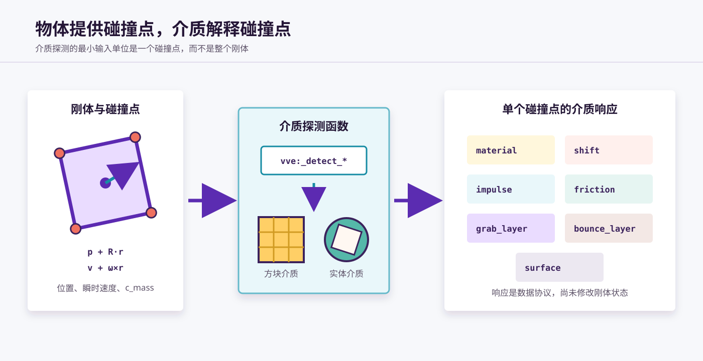
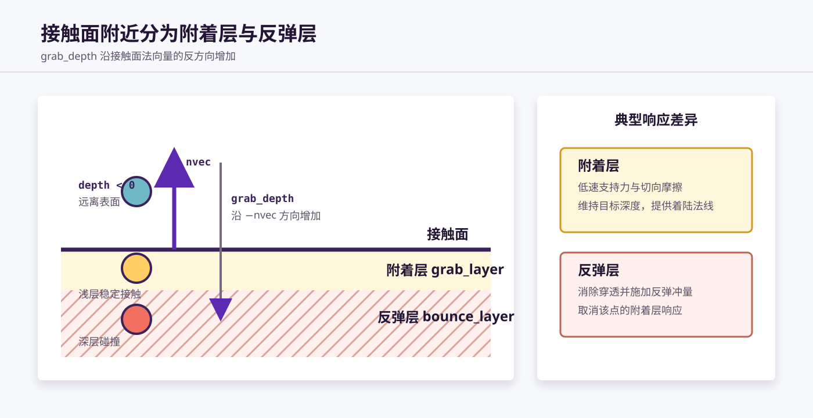
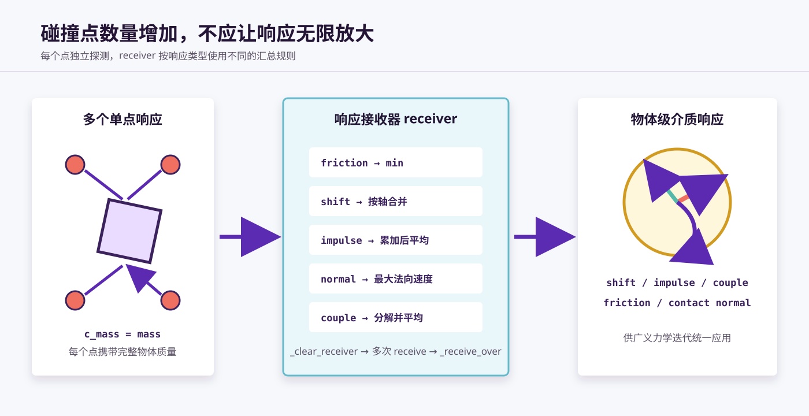

# 介质探测与介质响应

VVE 使用碰撞点描述物体与世界之间的接触。物体模型负责生成碰撞点，介质探测函数负责判断碰撞点所在的介质并输出响应，刚体再将所有碰撞点的响应汇总为物体级响应。

```text
物体模型 → 碰撞点 → 介质探测 → 单点介质响应 → 响应汇总 → 广义力学迭代
```



可以把二者的职责概括为：

- **介质探测**回答“这个碰撞点位于什么介质中”；
- **介质响应**回答“该介质要对这个碰撞点产生什么效果”。

介质响应只是输出数据。真正修改物体位置、线速度和角速度的过程，属于后续的[广义力学迭代](运动学迭代,%20力学迭代,%20运动同步.md#4-广义力学迭代)。

## 1. 碰撞点模型

介质探测的最小输入单位是碰撞点，而不是整个物体。

一个碰撞点由以下数据组成：

| 数据 | 含义 |
| --- | --- |
| `c_x/c_y/c_z` | 碰撞点的世界坐标 |
| `c_vx/c_vy/c_vz` | 碰撞点的瞬时线速度 |
| `c_mass` | 计算该碰撞点响应时使用的质量 |

### 1.1 质点的碰撞点

质点本身就是一个碰撞点，因此它的碰撞点位置和速度等于质点位置和速度：

```text
cpoint.position = object.position
cpoint.velocity = object.velocity
```

### 1.2 刚体的碰撞点位置

刚体碰撞点通常先在物体的局部坐标系中定义，再根据当前姿态转换到世界坐标系。

设碰撞点局部坐标为 `r_local = (u,v,w)`，局部坐标轴组成旋转矩阵 `R`，刚体质心为 `p`，则碰撞点世界坐标为：

```text
r = R · r_local
cpoint.position = p + r
```

例如，立方体刚体可以把八个顶点作为碰撞点。物体旋转时，这些点会随局部坐标系一起移动。

### 1.3 刚体的碰撞点速度

碰撞点速度不仅包含质心的平动速度，也包含刚体旋转产生的切向速度：

```text
cpoint.velocity = v + ω × r
```

其中：

- `v` 是刚体质心速度；
- `ω` 是角速度；
- `r` 是碰撞点相对质心的世界坐标位矢。

因此，同一个刚体上的不同碰撞点可能具有完全不同的瞬时速度。介质响应使用碰撞点速度，才能正确模拟旋转物体边缘的撞击、摩擦和支持力。

### 1.4 碰撞点质量

刚体碰撞点通常设置：

```text
c_mass = mass
```

每个碰撞点都使用整个物体的质量，但多个碰撞点的响应会在汇总阶段取平均。这样既方便单点介质模型独立计算，又不会因为增加碰撞点数量而无限放大物体受到的总响应。

## 2. 介质探测函数

所有 `vve:_detect_*` 函数都是介质探测函数。它们接收当前执行位置和碰撞点临时对象，输出该碰撞点的介质响应。

典型调用形式如下：

```mcfunction
execute as 0-0-0-0-0 at @s run function vve:_detect_material
```

调用前需要准备碰撞点数据：

```text
cpoint.center   = 碰撞点世界坐标
cpoint.velocity = 碰撞点瞬时速度
cpoint.mass     = 碰撞点质量
```

调用后得到响应标志、响应向量和接触信息。

### 2.1 探测函数概览

| 函数 | 主要用途 |
| --- | --- |
| `vve:_detect_material` | 通用介质探测，支持实体介质、流体、空气和实心方块材质 |
| `vve:_detect_solid` | 面向普通实心方块的简化探测 |
| `vve:_detect_liquid` | 在通用探测基础上计算流体浸入深度与浮力 |
| `vve:_detect_slope` | 增加斜面方块探测 |
| `vve:_detect_large` | 增加大范围实体介质探测 |
| `vve:_detect_box` | 用于自定义实体盒体之间的探测流程 |
| `vve:_detect_render` | 可视化碰撞点，不执行常规物理响应 |

这些函数的输入、输出和具体使用方法将在[介质探测函数](../工具模块/介质探测函数.md)中介绍。本章只讨论它们共同遵守的物理流程。

### 2.2 单点探测流程

以通用介质探测为例，单个碰撞点大致按以下顺序查询世界：

1. 清空上一次单点探测留下的响应；
2. 查询当前位置的实体介质；
3. 查询水、岩浆等流体介质；
4. 查询空气或可穿过方块；
5. 加载特殊方块的材质参数；
6. 对实心方块计算接触法线和浸入深度；
7. 根据接触状态生成介质响应。

部分介质会提前结束探测。例如，实体介质成功响应后，通常不会继续把同一个碰撞点按当前位置的方块介质重复处理。

## 3. 方块介质与实体介质

VVE 的世界介质模型由方块介质和实体介质共同组成。

### 3.1 方块介质

方块介质直接通过碰撞点所在的 Minecraft 方块判断，包括：

- 空气和其他可穿过方块；
- 水、岩浆等流体；
- 普通实心方块；
- 使用不同摩擦与反弹参数的材质类型；
- 斜面等具有特殊几何形状的方块介质。

实心方块会结合碰撞点在方块内部的位置和相邻方块状态，确定接触面法向量与浸入深度。

### 3.2 实体介质

实体介质使用 Minecraft 实体承载介质模型，可以表示：

- 可以旋转的盒体；
- 移动平台；
- 大范围曲面或特殊区域；
- 用户模块定义的自定义介质。

介质探测函数发现候选实体后，会通过 `vve:call_material` 调用该介质的 `check_material` 方法。内置介质可以走固定分支，自定义介质则可以通过 `module_control` 动态调用所属模块的方法。

实体介质的 `check_material` 负责判断碰撞点是否真正进入介质几何体，并在命中时生成响应。

### 3.3 介质类型编号

`material_response` 使用编号表示最终选中的介质类型：

| 编号范围 | 含义 |
| --- | --- |
| 正数 | 实体介质类型 |
| `0` | 空气介质 |
| 负数 | 方块介质类型 |

例如，项目当前使用负数区分普通实心方块、四类方块材质、水和岩浆。具体编号属于实现协议，调用者不应把“正数”或“负数”误解为响应强度。

## 4. 介质响应协议

介质探测函数不会直接修改物体，而是通过一组响应临时对象描述本次接触。

### 4.1 响应信号

| 信号 | 含义 |
| --- | --- |
| `material_response` | 介质类型编号 |
| `surface_response` | 强制运行姿态修正算法 |
| `grab_layer_response` | 附着层响应数量或状态 |
| `bounce_layer_response` | 反弹层响应数量或状态 |
| `friction_response` | 摩擦造成的速度保留系数 |
| `shift_response` | 是否存在位移修正 |
| `impulse_response` | 是否存在冲量响应 |
| `couple_response` | 是否存在力偶矩响应 |

### 4.2 位移响应

位移响应由一个世界坐标向量表示：

```text
shift = (shift_x, shift_y, shift_z)
```

它用于把已经进入介质的碰撞点移回目标接触深度，主要负责消除穿透。

### 4.3 冲量响应

冲量响应包含作用点和冲量矢量：

```text
impulse.center = (impulse_x, impulse_y, impulse_z)
impulse.vector = (impulse_fx, impulse_fy, impulse_fz)
```

作用点通常等于产生响应的碰撞点位置。冲量可以包含：

- 沿法向量的支持力或反弹冲量；
- 用于衰减切向速度的摩擦冲量；
- 流体产生的浮力冲量；
- 实体介质之间交换的碰撞冲量。

### 4.4 摩擦响应

`friction_response` 表示线速度和角速度在本次迭代后的保留比例。数值越小，摩擦造成的衰减越强。

介质还可以在碰撞冲量中加入切向摩擦分量。因此项目中同时存在整体速度衰减和接触点切向冲量两种摩擦表现。

### 4.5 接触法线与浸入深度

接触层响应包含：

```text
nvec       = 接触面朝向介质外侧的单位法向量
grab_depth = 沿 nvec 反方向浸入介质的距离
```

因此：

- `grab_depth > 0` 表示碰撞点已经沿法线反方向进入介质；
- `grab_depth = 0` 表示碰撞点位于接触面；
- `grab_depth < 0` 表示碰撞点位于接触面外侧，正在远离介质。

## 5. 附着层与反弹层

实心介质将接触面附近划分为附着层和反弹层。



### 5.1 附着层

附着层位于接触面附近，用于处理低速、浅层、趋于稳定的接触。

典型附着层响应包括：

- 把碰撞点维持在目标深度的位移修正；
- 抵消法向进入速度的支持力冲量；
- 衰减切向速度的摩擦冲量；
- 供物体着陆和姿态修正使用的接触法线。

碰撞点沿法线反方向进入附着层，但速度过大时，可以跳过低速附着响应，继续按深层碰撞处理。

### 5.2 反弹层

碰撞点进入介质较深时，会产生反弹层响应。

典型反弹层响应包括：

- 根据浸入深度消除穿透；
- 根据法向进入速度生成反弹冲量；
- 加入切向摩擦冲量；
- 取消该碰撞点的附着层响应。

当碰撞点的法向速度指向介质外侧时，介质可以忽略反弹冲量，避免在物体已经离开表面时再次把它弹回去。

### 5.3 流体中的层响应

带浮力的流体探测会根据浸入深度生成向上的浮力冲量，并把流体表面视为一种接触层信息。

这使流体响应可以复用物体级的接触数量、材质和法线汇总机制，同时仍通过专用的 `_detect_liquid` 计算浮力。

## 6. 刚体如何遍历碰撞点

刚体通常通过 `_iter_cpoints*` 接口完成所有碰撞点的探测与响应汇总。

一次遍历过程包括：

1. 清空物体级响应接收器；
2. 依次计算每个碰撞点的世界位置；
3. 计算碰撞点瞬时速度；
4. 调用一个 `_detect_*` 介质探测函数；
5. 将单点响应送入物体级接收器；
6. 遍历完毕后结算最终响应。

### 6.1 常用方案后缀

| 接口 | 含义 |
| --- | --- |
| `_iter_cpoints` | 基础碰撞点遍历方案 |
| `_iter_cpoints_c` | `couple` 方案，将偏心冲量分解为平动冲量与力偶矩 |
| `_iter_cpoints_l` | `liquid` 方案，为碰撞点启用浮力计算 |
| `_iter_cpoints_render` | 可视化碰撞点和探测位置 |

目前刚体应优先采用 `_c` 方案。它在接收每个碰撞点的冲量时，先计算相对质心的力矩：

```text
couple += r × J
```

然后分别汇总平动冲量和力偶矩，使旋转响应的职责更清晰。

### 6.2 固定与动态碰撞点

固定碰撞点通常在模型局部坐标系中预先定义，例如长方体的八个顶点。

动态碰撞点则根据物体之间的相对位置和包围盒临时计算采样位置，适合补充实体盒体之间的接触。两者最终都会构造相同的 `cpoint` 数据，并调用相同的介质探测协议。

## 7. 多碰撞点响应汇总

一个刚体可能在同一物理帧中有多个碰撞点命中介质。物体不会立即逐点修改自身状态，而是先把响应交给 `receiver` 汇总。



### 7.1 汇总流程

```text
vve:object/_clear_receiver
    ↓
遍历碰撞点并多次接收响应
    ↓
vve:object/_receive_over
    ↓
物体级介质响应
```

### 7.2 主要汇总规则

| 响应 | 汇总规则 |
| --- | --- |
| 摩擦 | 取数值最小、衰减最强的摩擦系数 |
| 位移 | 同方向取更强修正，不同方向按坐标轴组合 |
| 冲量 | 汇总所有有效冲量后按响应点数量平均 |
| 冲量作用点 | 按各响应点的位置求平均作用点 |
| 附着层 | 累计有效附着层接触点数量 |
| 反弹层 | 累计有效反弹层接触点数量 |
| 接触法线 | 保留法向速度绝对值最大的接触法线 |
| 材质 | 按介质类型优先规则保留代表性材质 |
| 力偶矩 | `_c` 方案中逐点分解，最后按有效响应点数量平均 |

对冲量和力偶矩取平均，可以避免碰撞点越多，物体受到的总响应就无条件越大。这与每个碰撞点使用 `c_mass = mass` 是配套设计。

### 7.3 汇总后的应用

`_receive_over` 输出的物体级响应随后由模块主程序应用：

```mcfunction
execute if score shift_response int matches 1 run function vve:object/_apply_shift
execute if score impulse_response int matches 1 run function vve:object/_apply_impulse_f
execute if score couple_response int matches 1 as 0-0-0-0-0 run function vve:object/_apply_couple
function vve:object/_apply_friction
```

因此，碰撞点遍历负责“收集与汇总”，广义力学迭代负责“应用到物体”。

## 8. 实体介质的响应副作用

方块介质本身不会因碰撞而运动，但实体介质可以同时也是一个物理对象。

当碰撞点撞击可接收冲量的实体介质时，介质响应除了向探测方返回冲量，还可以把大小相反、方向相反的冲量写入自身的 `impulse_receiver`：

```text
探测方接收： J
实体介质接收：-J
```

这是实体介质响应的副作用。下一次实体介质执行力学迭代时，会读取并应用收到的外部冲量，从而实现物体之间的双向碰撞效果。

如果实体介质被标记为静止表面，则可以只向探测方提供响应，而不让自身运动。

## 9. 与物理帧的关系

介质探测发生在运动学迭代之后、介质响应应用之前：

```text
运动学迭代
    ↓ 使用新位置、新姿态
碰撞点介质探测
    ↓ 汇总单点响应
物体级介质响应
    ↓
广义力学迭代
```

这种顺序保证介质模型看到的是物体推进后的几何状态，而力学迭代得到的新速度和角速度将供下一次运动学迭代使用。

## 10. 概念总结

| 概念 | 职责 |
| --- | --- |
| 碰撞点 `cpoint` | 描述物体表面一个采样点的位置、瞬时速度和质量 |
| 介质探测函数 `_detect_*` | 查询单个碰撞点所处介质并输出单点响应 |
| 介质响应 | 描述介质希望产生的位移、冲量、摩擦和接触状态 |
| 碰撞点遍历 `_iter_cpoints*` | 对刚体所有碰撞点执行探测并汇总响应 |
| 响应接收器 `receiver` | 将多个单点响应合并为物体级响应 |
| 广义力学迭代 | 将汇总后的响应真正应用到物体状态 |

这套结构把物体几何、世界介质和力学处理解耦：同一个物体可以切换介质探测方案，同一个介质也可以响应质点、刚体和用户自定义模型提供的碰撞点。
