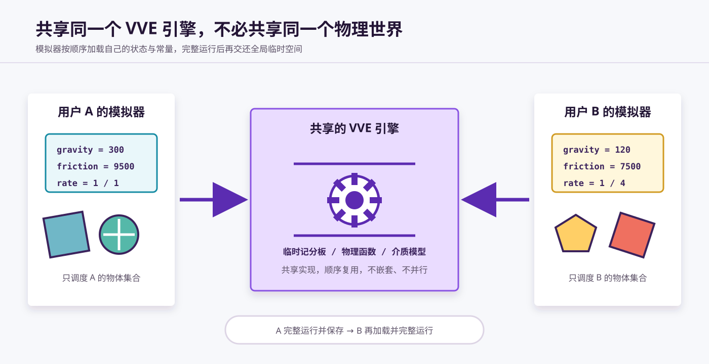
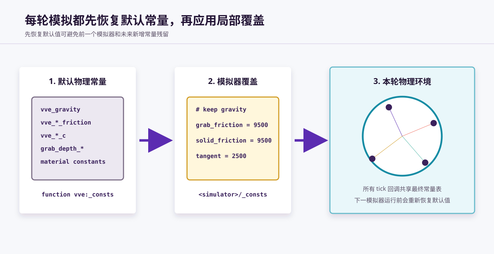
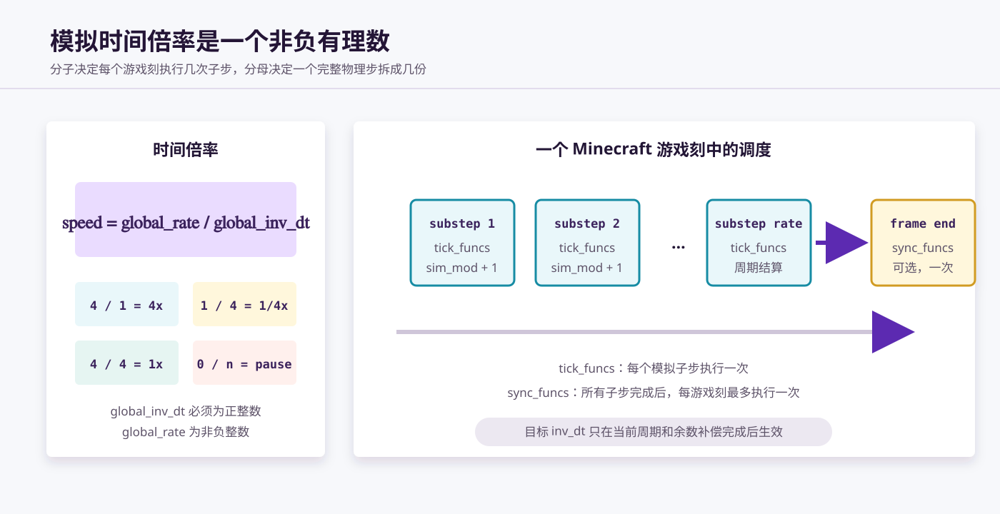

# 常量表与模拟器

VVE 的物理函数是一套共享的计算工具，而模拟器负责为这些工具准备一组具体的物理环境，并决定哪些物体以怎样的时间倍率运行。

可以把 VVE 引擎理解为一间公共实验室：

- **常量表**规定本轮实验中的重力、摩擦、浮力和接触参数；
- **模拟器**保存自己的时间状态与回调列表，在运行前布置环境，运行后收回状态；
- **物理对象**由某一个模拟器调度，并使用该模拟器当前加载的常量表完成计算。

模拟器最重要的设计意图不是单纯提供“统一时钟”，而是**隔离不同的物理模拟环境**。用户 A 和用户 B 可以共同使用同一套 VVE 函数，却让各自的物体采用不同的重力、摩擦、反弹参数和时间倍率。



## 1. 常量表

本文所说的“常量表”，专指会影响物理环境的参数，不包括数学函数使用的固定常数、记分板初始化值或模块实例的普通属性。

默认常量表由 `vve:_consts` 写入共享临时记分板。当前主要包含：

| 类别 | 代表性常量 | 控制的物理性质 |
| --- | --- | --- |
| 空气与流体 | `vve_air_friction`、`vve_liquid_friction`、`vve_liquid_c` | 空气阻力、流体阻力与浮力 |
| 水与岩浆 | `vve_water_*`、`vve_lava_*` | 不同流体的摩擦与浮力 |
| 实心介质 | `vve_grab_friction*`、`vve_solid_friction*`、`vve_solid_bounce_inv` | 接触摩擦、切向摩擦与反弹 |
| 接触层 | `grab_depth_*`、`grab_layer_*` | 附着深度、速度过滤与姿态修正阈值 |
| 重力 | `vve_gravity` | 每个完整物理步施加的重力加速度 |
| 介质几何 | `vve_solid_r`、`vve_slope_block_d` | 实心介质和斜面探测使用的范围参数 |
| 方块材质 | `vve:material/_consts` 加载的常量 | 各类方块介质的摩擦、反弹等参数 |

这些值采用 VVE 的定点数与离散时间约定。理解它们时，应把它们看作“一个完整物理步中的环境参数”，再由模拟器的时间拆分机制换算到各个子步。具体拆分方式将在[运动慢放与运动拆解](运动慢放,%20运动拆解.md)中说明。

### 1.1 先恢复默认值，再覆盖

每个模拟器的 `_consts` 都必须先调用：

```mcfunction
function vve:_consts
```

然后再覆盖需要定制的参数：

```mcfunction
# <simulator>/_consts
function vve:_consts

scoreboard players set vve_gravity int 120
scoreboard players set vve_solid_friction int 9500
```

这个顺序是常量隔离成立的前提。不能只写本模拟器与默认环境不同的几项，而省略 `vve:_consts`。

原因有两个：

1. 前一个模拟器可能修改过其他常量，直接覆盖少数值会让旧环境残留到当前模拟器；
2. VVE 的后续版本可能增加当前模拟器尚不知道的常量，先恢复默认值可以让新常量自动获得有效初值。

因此，每轮模拟都从完整的 VVE 默认环境开始，再形成当前模拟器自己的常量表。



### 1.2 常量表属于一次运行环境

常量表保存在共享的临时记分板中，并不永久附着在某个物体上。模拟器加载自己的常量后，本轮调度的所有物体和回调都会读取同一张表。

这意味着：

- 同一模拟器中的物体天然共享一套物理环境；
- 需要不同环境的物体，应交给不同模拟器调度；
- 一个物体原则上只由一个模拟器调度，否则它可能在同一游戏刻中被重复计算，或交替使用不同环境。

## 2. 模拟器保存的状态

VVE 预设模拟器保存以下数据：

| 状态 | 含义 |
| --- | --- |
| `global_sim_mod` | 当前完整物理步内已经推进到的拆分相位 |
| `global_inv_dt` | 当前生效的拆分数，也是时间倍率的分母 |
| `global_set_inv_dt` | 请求在下一个完整周期使用的拆分数 |
| `global_rate` | 每个 Minecraft 游戏刻执行的模拟子步数，也是时间倍率的分子 |
| `tick_funcs` | 每个模拟子步都要执行一次的回调函数列表 |
| `sync_funcs` | 所有子步结束后可选执行一次的同步回调列表 |

预设值为：

```text
global_sim_mod = 0
global_inv_dt = 1
global_set_inv_dt = 1
global_rate = 1
tick_funcs = []
sync_funcs = []
```

此时模拟时间倍率为 `1 / 1 = 1`，即每个游戏刻推进一个完整物理步。

## 3. 一轮模拟器调度

`main` 是模拟器每个 Minecraft 游戏刻的主程序。它的完整流程可以概括为：

```text
读取本模拟器状态（_get）
    ↓
恢复 VVE 默认常量并应用本模拟器覆盖（_consts）
    ↓
执行 global_rate 个模拟子步（main_loop）
    ├─ 推进 global_sim_mod
    ├─ 运行固定调度和 tick_funcs
    └─ 结算拆分周期与 inv_dt 切换
    ↓
可选运行一次 sync_funcs
    ↓
保存本模拟器状态（_store）
```

`main_loop` 使用递归执行 `global_rate` 次，但在递归返回时会恢复 `global_rate` 的原值。因此，`global_rate` 是持久的速率配置，不是每轮结束后归零的计数器。

## 4. 模拟时间倍率

模拟器使用一个非负有理数表示相对于默认物理时间的倍率：

```text
模拟时间倍率 = global_rate / global_inv_dt
```

其中：

- `global_rate` 是非负整数，表示每个游戏刻执行多少个子步；
- `global_inv_dt` 是正整数，表示一个完整物理步被拆成多少个子步。

例如：

| `global_rate` | `global_inv_dt` | 时间倍率 | 含义 |
| ---: | ---: | ---: | --- |
| `1` | `1` | `1` | 正常速度 |
| `4` | `1` | `4` | 每游戏刻推进四个完整物理步 |
| `1` | `4` | `1/4` | 一个完整物理步分四个游戏刻推进 |
| `4` | `4` | `1` | 每游戏刻运行四个子步，总时间仍为正常速度 |
| `0` | 任意正整数 | `0` | 时间暂停 |

只要分子和分母按上述约束取值，就可以表示任意正有理数的模拟时间倍率。



### 4.1 `global_rate = 0` 是时间暂停

当 `global_rate = 0` 时，`main` 不进入 `main_loop`：

- `global_sim_mod` 不推进；
- `tick_funcs` 不执行；
- 物理状态停留在当前相位；
- `sync_funcs` 若存在，仍会在游戏刻末执行。

这应被定义为**模拟时间暂停**，而不是模拟器停止。模拟器的 `tick` 仍可继续被 Minecraft 调度，状态也仍会读取和保存。`_stop` 则会清除对 `tick` 的计划调度，二者含义不同。

### 4.2 拆分相位 `global_sim_mod`

每个子步开始时：

```text
global_sim_mod ← global_sim_mod + 1
```

物理模块可以据此判断当前处于完整物理步的哪个阶段。例如，拆分运动模块可以在普通相位只推进部分运动，在周期末处理余数补偿并执行力学迭代。

回调执行完后，模拟器使用当前 `global_inv_dt` 对相位取模：

```text
global_sim_mod ← global_sim_mod mod global_inv_dt
```

相位回到 `0`，表示一个完整拆分周期结束。

### 4.3 延迟切换 `global_inv_dt`

外部程序不应在任意相位直接修改正在生效的 `global_inv_dt`，而应修改 `global_set_inv_dt`。只有当当前相位完成旧周期并回到 `0` 时，模拟器才执行：

```text
global_inv_dt ← global_set_inv_dt
```

因此，改变拆分数不会截断当前周期。旧周期的所有子步，包括周期末的余数补偿，都会完整执行，然后新拆分数才从下一个周期开始生效。

这项约束用于保证不同速率设置下的模拟结果一致。如果在周期中途直接换分母，当前完整物理步可能少执行或多执行一部分运动，误差会随着切换累积。

## 5. `tick_funcs` 与 `sync_funcs`

模拟器通过两个函数列表扩展调度内容。列表元素是可由宏函数调用的函数 ID 字符串，例如：

```mcfunction
data modify storage vve:io input set value "vve:cublock/tick"
function vve:simulator/_append_tick_func
```

### 5.1 `tick_funcs`

`tick_funcs` 中的每个函数会在**每个模拟子步**执行一次。

它适合调度：

- 物体的运动学迭代与力学迭代；
- 依赖 `global_sim_mod` 的运动拆分程序；
- 必须与模拟时间同步推进的模块逻辑。

当 `global_rate = 4` 时，同一个 `tick_func` 每游戏刻执行四次；当 `global_rate = 0` 时，它不会执行。

### 5.2 `sync_funcs`

`sync_funcs` 是可选列表。它在本游戏刻的所有模拟子步结束后执行一次，与 `global_rate` 无关。

它适合显式分离了“物理计算”和“显示同步”的模块：先在 `tick_funcs` 中执行多次计算，再在 `sync_funcs` 中把最终结果统一同步到 Minecraft 实体，从而避免一游戏刻内重复写入显示状态。

标准物体的 `tick` 也可以在自己的流程中完成运动同步，因此使用 `tick_funcs` 并不意味着必须同时注册 `sync_funcs`。两类回调与[运动学迭代、力学迭代和运动同步](运动学迭代,%20力学迭代,%20运动同步.md)中的阶段划分相对应，但是否拆开由具体模块决定。

### 5.3 回调列表接口

预设模拟器提供以下管理接口：

| 接口 | 作用 |
| --- | --- |
| `_append_tick_func` | 添加一个不重复的 `tick` 回调 |
| `_find_tick_func` | 查询 `tick` 回调是否存在 |
| `_remove_tick_func` | 删除指定 `tick` 回调 |
| `_clear_tick_funcs` | 清空全部 `tick` 回调 |
| `_append_sync_func` | 添加一个不重复的同步回调 |
| `_find_sync_func` | 查询同步回调是否存在 |
| `_remove_sync_func` | 删除指定同步回调 |
| `_clear_sync_funcs` | 清空全部同步回调 |
| `_clear` | 同时清空两类回调 |

添加、查询和删除接口都通过 `storage vve:io input` 接收函数 ID。添加接口会先查询，避免同一个函数在列表中重复注册。

修改回调列表时，应遵守模拟器临时对象的读写流程：

```mcfunction
function vve:simulator/_get
data modify storage vve:io input set value "example:object/tick"
function vve:simulator/_append_tick_func
function vve:simulator/_store
```

## 6. 多个模拟器的环境隔离

不同模拟器可以拥有各自的：

- 常量覆盖函数；
- 时间倍率与拆分相位；
- `tick_funcs` 和 `sync_funcs`；
- 被调度的物体集合。

但底层物理函数、临时记分板和部分 storage 是共享的。因此，多模拟器隔离依赖以下顺序：

```text
模拟器 A：_get → 加载 A 的常量 → 完整运行 A → _store
模拟器 B：_get → 加载 B 的常量 → 完整运行 B → _store
```

它们只能**依次隔离运行**，不能嵌套，也不能并行。模拟器 A 尚未保存时调用模拟器 B，会覆盖共享临时状态和常量表；从 B 返回后，A 也无法可靠地继续原来的计算环境。

### 6.1 多用户使用场景

假设用户 A 和用户 B 在同一个数据包中共同使用 VVE：

```text
用户 A 的模拟器
  gravity = 300
  solid_friction = 9500
  rate = 1 / 1
  只调度带有 A 标签的物体

用户 B 的模拟器
  gravity = 120
  solid_friction = 7500
  rate = 1 / 4
  只调度带有 B 标签的物体
```

两组物体调用的仍然是同一套 `vve:object/*`、介质探测和响应函数，但这些函数在各自模拟器运行期间读取不同的常量表。这样既复用了引擎实现，又避免要求所有用户接受同一套物理参数。

隔离的单位是“模拟器的一整轮运行”，不是单个函数或单个物体。要保持边界清晰，应让每个物体原则上只属于一个模拟器，并让一个模拟器完整结束后再启动下一个。

## 7. 自定义模拟器

`vve:simulator` 是预设模拟器。需要固定调度特定物体或使用专用环境时，可以通过 `vve_simulator_1.0` 模板构建自定义模拟器。

项目中的两个示例展示了这种做法：

| 模拟器 | 自定义内容 |
| --- | --- |
| `vve_examples:dice_simulator` | 在 `main_loop` 中调度多类骰子，并使用更适合骰子滚动的摩擦参数 |
| `vve_examples:car_simulator` | 在 `main_loop` 中调度测试车辆，并使用较高的切向摩擦参数 |

自定义模拟器通常需要完成三项工作：

1. 在 `_consts` 中先调用 `vve:_consts`，再覆盖环境参数；
2. 在 `main_loop` 中固定调用自己的模块，或通过 `tick_funcs` 接收动态回调；
3. 使用独立的数据模板保存时间状态与回调列表。

## 8. 概念总结

| 概念 | 定义 | 关键约束 |
| --- | --- | --- |
| 常量表 | 当前模拟环境使用的物理参数集合 | 每轮必须先恢复 VVE 默认值，再局部覆盖 |
| 模拟器 | 加载环境、维护时间状态并调度物体的模块 | 多个模拟器只能依次完整运行 |
| `global_rate` | 每游戏刻执行的子步数 | `0` 表示时间暂停 |
| `global_inv_dt` | 当前完整物理步的拆分数 | 必须为正整数，不在周期中途直接切换 |
| `global_set_inv_dt` | 下一周期准备使用的拆分数 | 当前周期及余数补偿完成后生效 |
| `global_sim_mod` | 当前拆分周期的相位 | 供运动拆分模块判断普通步与关键步 |
| `tick_funcs` | 每个子步执行的物理回调 | 受 `global_rate` 控制 |
| `sync_funcs` | 每游戏刻末可选执行一次的同步回调 | 可省略，适用于计算与显示分离的模块 |

常量表回答“这个物理世界遵守什么规则”，模拟器回答“哪些物体在这个世界中以多快的时间运行”。把环境参数和调度状态一起封装到模拟器中，VVE 才能在共享一套引擎的同时，为不同模块和不同用户提供彼此隔离的物理世界。
