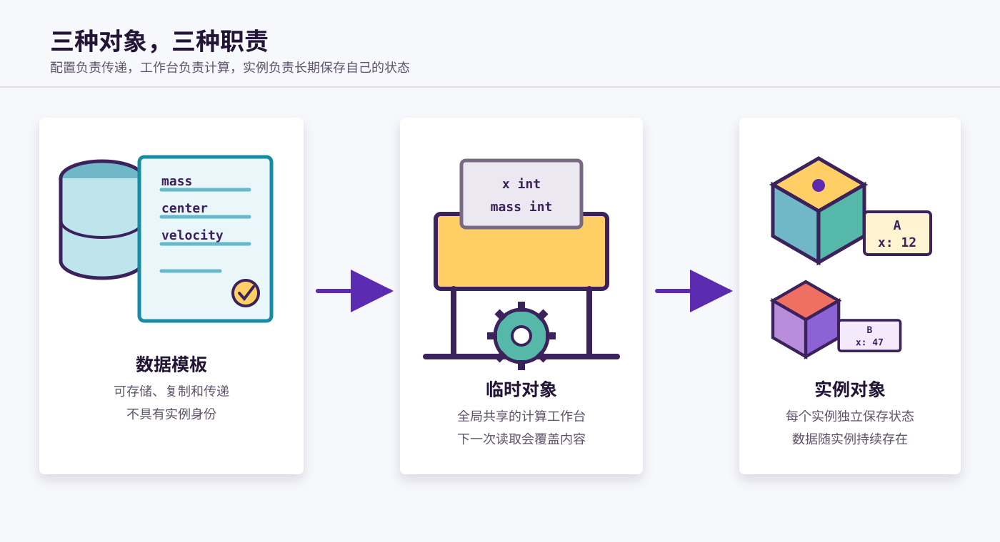
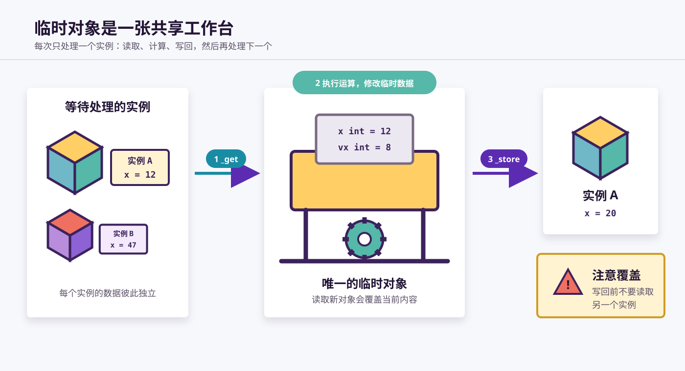
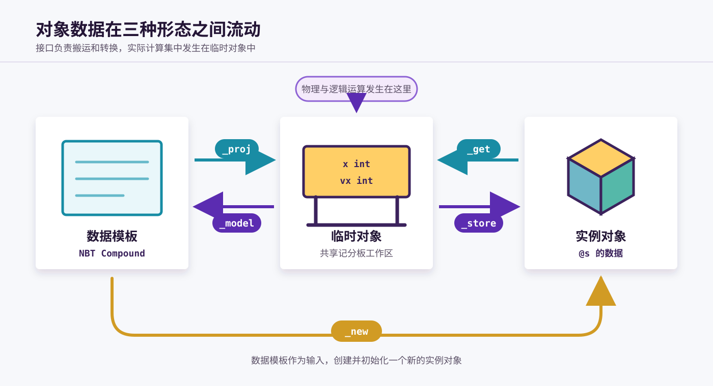

# 数据模板、临时对象与实例对象

VVE 会让同一组对象数据在三种形态之间转换：数据模板、临时对象和实例对象。

可以把模块运行想象成一条生产线：

- **数据模板**是产品配置单；
- **临时对象**是公共加工台；
- **实例对象**是每件产品独立保存的状态档案。



三者可以描述相同的字段，但服务于不同场景。数据模板便于存储和传递，临时对象便于计算，实例对象负责长期保存每个实例自己的状态。

## 1. 共同的数据结构

模块的对象格式文档 `.doc.mcfo` 描述了对象包含哪些字段，以及每个字段对应的数据位置和精度。

以 `vve_cublock` 为例，其 `_this` 对象包含：

```text
_this:{
    a:<a,int,1w>,
    mass:<mass,int,1>,
    inertia:<inertia,int,100>,
    center:{
        <x,int,1w>, <y,int,1w>, <z,int,1w>
    },
    velocity:{
        <vx,int,1w>, <vy,int,1w>, <vz,int,1w>
    },
    ...
}
```

这些字段可以分别表现为：

- 数据模板中的 NBT 字段；
- 临时对象中的假玩家记分板值；
- 实例对象中以 `@s` 为记分板持有者的数据。

MOT 根据同一份对象格式生成数据搬运和精度转换代码，从而保证三种对象使用一致的数据结构。

### 1.1 定点数精度

Minecraft 记分板只能保存整数，因此 VVE 使用放大后的整数表示小数。

| 对象格式 | 记分板倍率 | 示例 |
| --- | ---: | --- |
| `1` | 1 | 质量 `17` 表示 17 kg |
| `100` | 100 | 惯量 `458` 表示 4.58 |
| `1w` | 10,000 | 坐标 `12500` 表示 1.25 |
| `100w` | 1,000,000 | 角速度 `500000` 表示 0.5 |

`_proj`、`_model` 和对象赋值程序会按照对象格式自动完成倍率转换。

## 2. 数据模板

数据模板是符合模块对象结构的一份 NBT Compound。它是一种通用的数据形式，不绑定某个固定 storage 路径。

数据模板可以：

- 保存在数据库中；
- 在不同 storage 路径之间复制；
- 作为接口输入或输出；
- 修改部分字段后用于创建新实例；
- 从临时对象重新构建。

一个简化的刚体数据模板如下：

```snbt
{
    mass: 17,
    inertia: 4.58d,
    center: [0.0d, 100.0d, 0.0d],
    velocity: [0.0d, 0.0d, 0.0d],
    angular_vec: [0.0d, 0.0d, 0.0d]
}
```

数据模板只保存数据。它没有实例身份，不会自行执行主程序，也不与使用它创建出的实例保持同步。

### 2.1 预设数据模板

模块通常会在初始化时生成一份预设数据模板：

```text
storage $(project_name):class $(module_name)_plate
```

例如：

```text
storage vve_examples:class dice_6_s_plate
```

这个位置不是“数据模板”的定义，只是模块提供的一份默认配置。其他数据库位置中只要保存了符合相同结构的数据，也可以作为该模块的数据模板。

预设数据模板通常由 `_class` 按以下步骤生成：

1. 调用 `_zero`，清空临时对象；
2. 设置默认位置、姿态、质量、尺寸等字段；
3. 调用 `_model`，把临时对象转换成数据模板；
4. 将输出保存到 `storage $(project_name):class $(module_name)_plate`。

### 2.2 输入与输出位置

模块通常通过以下位置传递数据模板：

| 位置 | 用途 |
| --- | --- |
| `storage $(project_name):io input` | 接口输入的数据模板 |
| `storage $(project_name):io result` | 接口输出的数据模板 |
| `storage $(project_name):class $(module_name)_plate` | 模块提供的预设数据模板 |

`input` 和 `result` 是调用过程中的传递位置，不是数据模板唯一允许存在的位置。

## 3. 临时对象

临时对象是供程序执行运算的一份全局共享数据。它通常由固定假玩家的记分板值组成：

```mcfunction
scoreboard players set x int 0
scoreboard players set mass int 0
scoreboard players set angular_x int 0
```

这里的 `x int`、`mass int` 等不属于某个实例。它们是一组公共计算寄存器，任何兼容的程序都可以读取或修改。

### 3.1 为什么需要临时对象

VVE 的大量计算通过记分板整数运算完成。相比不断对实体选择器和复杂 NBT 路径操作，临时对象提供了统一、紧凑的计算环境。

典型流程是：

1. 把外部数据读取到临时对象；
2. 在临时对象上执行运动学、力学或其他计算；
3. 把结果转换或写回原来的数据载体。

### 3.2 临时对象接口

| 接口 | 数据方向 | 作用 |
| --- | --- | --- |
| `_zero` | 无 → 临时对象 | 将临时对象的全部字段清零 |
| `_proj` | 数据模板 → 临时对象 | 将 `io input` 投射到临时对象 |
| `_model` | 临时对象 → 数据模板 | 在 `io result` 中构建数据模板 |
| `_get` | 实例对象 → 临时对象 | 读取当前执行实例的数据 |
| `_store` | 临时对象 → 实例对象 | 将计算结果写回当前执行实例 |

### 3.3 临时对象是共享的

临时对象不是每个实例各有一份，而是所有实例轮流使用同一张工作台。



因此，临时对象只适合保存当前调用过程中的数据。以下顺序是完整的：

```mcfunction
function example:object/_get
# 在这里执行计算
function example:object/_store
```

如果在 `_store` 之前又对另一个实例调用 `_get`，当前临时对象会被新实例的数据覆盖。之后写回的数据就不再属于原来的实例。

> **重要：** 临时对象没有自动的嵌套保护。调用者需要自行保证从读取到写回之间的数据完整性。

## 4. 实例对象

实例对象是保存在当前执行实体 `@s` 上的对象数据。每个实例都有一份独立状态，例如：

```mcfunction
@s mass
@s x
@s vx
@s angular_x
```

这些数据会跨 tick 持续存在，并随着实例的运动和交互不断更新。

严格来说，实例对象指的是 `@s` 上的对象数据，不包括实例实体、乘客显示实体、标签等外围结构。为了便于入门，本章在描述创建和运行流程时会将它们统称为“实例”。

### 4.1 从数据模板创建实例对象

`_new` 接口通常接收：

```text
storage $(project_name):io input
```

其中保存待创建实例的数据模板。接口先召唤实例根实体，再由内部函数 `set` 把数据模板的各字段写入 `@s`：

```mcfunction
execute store result score @s mass run \
    data get storage vve_examples:io input.mass

execute store result score @s x run \
    data get storage vve_examples:io input.center[0] 10000
```

随后，`set_operation` 可以继续配置显示物、标签、材质类型和模块编号等实例相关内容。

实例创建完成后，修改原数据模板不会影响已经创建的实例；实例后续运动也不会自动修改原数据模板。

### 4.2 实例对象的运行

主程序通常以实例为 `@s`，执行以下过程：

```mcfunction
function example:object/_get
# 运动学迭代
# 介质探测
# 力学迭代
# 运动同步
function example:object/_store
```

`_get` 把该实例的状态搬到共享临时对象，计算程序修改临时对象，最后 `_store` 将结果写回同一个实例。

## 5. 三种对象之间的数据流



### 5.1 数据模板与临时对象

```text
数据模板 ──_proj──> 临时对象
数据模板 <─_model── 临时对象
```

`_proj` 读取 `io input`，将 NBT 字段转换成记分板整数。`_model` 执行相反过程，将临时对象转换成结构化 NBT，并输出到 `io result`。

### 5.2 实例对象与临时对象

```text
实例对象 ──_get───> 临时对象
实例对象 <─_store── 临时对象
```

这组接口不需要经过数据模板。它们直接在当前执行实体的记分板与公共临时记分板之间复制数据。

### 5.3 数据模板与实例对象

```text
数据模板 ──_new / set──> 实例对象
```

`_new` 使用 `io input` 中的数据模板创建实例。内部函数 `set` 负责字段赋值，`set_operation` 负责实例的其他初始化操作。

## 6. 常用工作流

### 6.1 使用预设数据模板创建实例

```mcfunction
data modify storage example:io input set from storage example:class object_plate
execute positioned ~ ~ ~ run function example:object/_new
```

### 6.2 修改模板后创建实例

需要通过临时对象进行复杂计算时：

```mcfunction
data modify storage example:io input set from storage example:class object_plate
function example:object/_proj

# 修改临时对象
scoreboard players set mass int 30
scoreboard players set vx int 10000

function example:object/_model
data modify storage example:io input set from storage example:io result
execute positioned ~ ~ ~ run function example:object/_new
```

只修改少数字段时，也可以直接操作数据模板：

```mcfunction
data modify storage example:io input set from storage example:class object_plate
data modify storage example:io input.mass set value 30
function example:object/_new
```

### 6.3 更新一个运行中的实例

```mcfunction
execute as @e[tag=example_object,limit=1] run function example:object/_accelerate
```

`example:object/_accelerate` 在同一次实例调用中完成读取和写回：

```mcfunction
function example:object/_get

# 修改临时对象
scoreboard players add vx int 1000

function example:object/_store
```

调用 `_get` 和 `_store` 时必须确保 `@s` 始终是同一个实例。

## 7. 使用原则

1. **数据模板用于存储和传递。** 它适合数据库、接口输入输出和实例创建，不负责实时计算。
2. **临时对象用于运算。** 它是共享工作区，内容短暂，使用时必须注意覆盖问题。
3. **实例对象用于保持状态。** 每个实例独立保存自己的运行数据。
4. **复杂修改使用 `_proj` 和 `_model`。** 这可以复用记分板计算程序并自动处理精度转换。
5. **运行实例使用 `_get` 和 `_store`。** 读取、计算、写回应当形成完整过程。
6. **不要把预设模板当作唯一模板。** `class/<module>_plate` 只是默认配置，数据模板可以存在于任何合适的数据库位置。

## 8. 概念总结

| 概念 | 工厂类比 | 数据载体 | 生命周期 |
| --- | --- | --- | --- |
| 数据模板 | 产品配置单 | NBT Compound | 可长期保存、复制和传递 |
| 临时对象 | 公共加工台 | 共享假玩家记分板 | 仅保证当前计算过程中的有效性 |
| 实例对象 | 产品自己的状态档案 | 当前实体 `@s` 的数据 | 随实例持续存在并不断更新 |

这套设计把存储、计算和实例状态分离开来：数据模板提供通用交换格式，临时对象集中执行高频计算，实例对象则为每个物理对象保存独立的长期状态。
