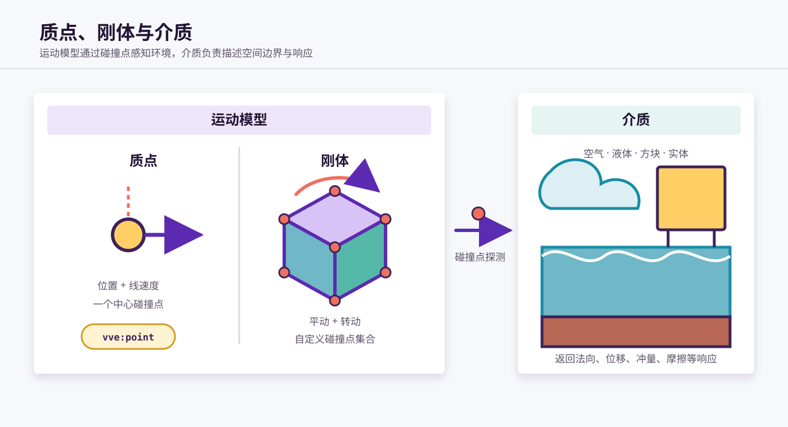
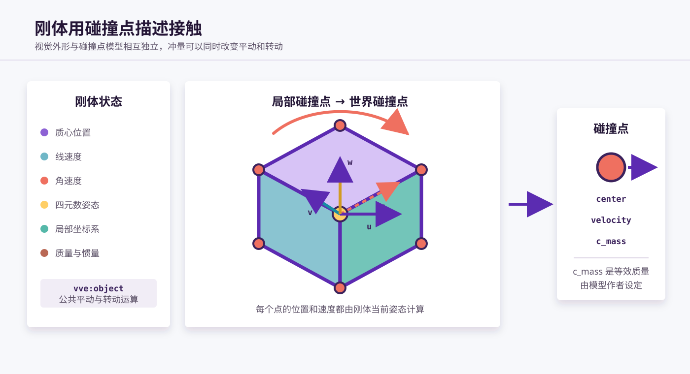
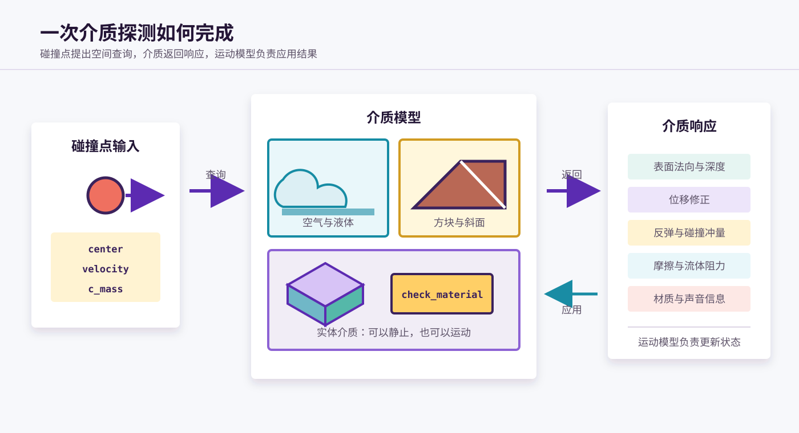

# 模型：质点、刚体与介质

VVE 使用质点、刚体和介质描述物理世界中的不同职责。

- **质点**和**刚体**是两种运动模型，决定物体如何保存和更新运动状态；
- **介质**是碰撞与环境职责，决定碰撞点在某个空间位置会得到什么响应。

它们并不是三个完全互斥的类别。刚体既可以只负责自身运动，也可以同时成为供其他物体探测的实体介质。



## 1. 两个分类维度

理解三类模型时，可以把它们拆成两个维度。

### 1.1 运动模型

运动模型回答以下问题：

- 物体保存哪些运动状态？
- 每帧如何更新位置和姿态？
- 收到位移、冲量和摩擦响应后，怎样修改自身状态？

VVE 提供两种基础运动模型：

| 运动模型 | 平动 | 转动 | 碰撞点 |
| --- | --- | --- | --- |
| 质点 | 支持 | 不支持 | 中心位置上的单个碰撞点 |
| 刚体 | 支持 | 支持 | 由模型作者定义的碰撞点集合 |

### 1.2 介质职责

介质职责回答另一组问题：

- 某个空间位置是否位于介质内部？
- 接触面的法向和侵入深度是什么？
- 应当返回怎样的位移、冲量、摩擦或阻力？
- 当前介质具有什么材质属性？

刚体可以同时承担实体介质职责。此时它一方面根据物理响应运动，另一方面也能被其他物体的碰撞点探测。

本文暂不讨论质点兼任实体介质的情况。

## 2. 碰撞点：运动模型与介质的共同协议

质点和刚体虽然使用不同的运动状态，但都通过碰撞点探测介质。

VVE 中的碰撞点 `cpoint` 包含三组数据：

```text
cpoint:{
    center:{c_x, c_y, c_z},
    velocity:{c_vx, c_vy, c_vz},
    mass:c_mass
}
```

| 数据 | 含义 |
| --- | --- |
| `center` | 碰撞点的世界坐标 |
| `velocity` | 碰撞点相对于世界的速度 |
| `c_mass` | 碰撞点参与介质响应计算时使用的等效质量 |

碰撞点是一次介质探测所需的临时数据，不是独立存在的模块实例。运动模型生成碰撞点，介质读取碰撞点并返回响应。

因此，两侧只需要遵守同一套碰撞点协议：

```text
运动模型 ──生成碰撞点──> 介质探测 ──>返回响应──> 运动模型
```

## 3. 质点模型

质点是最简单的运动模型。它只保存中心位置和线速度：

```text
point:{
    center:{x, y, z},
    velocity:{vx, vy, vz}
}
```

质点没有：

- 体积和形状；
- 姿态和局部坐标系；
- 角速度；
- 惯量或惯性张量。

标准内置模型为 `vve:point`。

### 3.1 质点的运动

一次普通质点迭代的流程如下：

1. 根据线速度更新中心位置。
2. 将中心位置和线速度直接写入碰撞点。
3. 使用该碰撞点探测介质。
4. 接收位移、冲量和摩擦响应。
5. 施加重力等外部加速度。
6. 将结果写回实例并同步实体位置。

由于碰撞点位于质点中心，所以：

```text
碰撞点位置 = 质点位置
碰撞点速度 = 质点速度
```

介质响应只能改变质点的位置和线速度，不会产生旋转。

### 3.2 质点的质量

标准质点对象不保存质量字段。`vve:point` 按单位等效质量处理介质碰撞，即在普通主程序中令：

```mcfunction
scoreboard players set c_mass int 1
```

用户定义的真实质量由外部物理系统维护。施加外力或冲量时，外部程序应根据所采用的质量自行完成换算：

```text
加速度 = 力 / 质量
速度变化 = 冲量 / 质量
```

这种设计让质点模型只维护最少的状态，也避免为不需要质量的简单物体增加运行成本。

### 3.3 质点适合的场景

质点适合以下情况：

- 只关心轨迹，不关心姿态；
- 可以用单个位置代表物体与环境的接触；
- 需要同时模拟大量简单对象；
- 物体的显示外观不参与物理碰撞。

质点的视觉表现可以比物理模型更大或更复杂，但在物理系统中，它仍然只是一个没有体积的探测点。

## 4. 刚体模型

刚体在平动状态之外，还需要描述物体的旋转。

一个典型刚体包含：

| 状态 | 作用 |
| --- | --- |
| 质心位置 | 描述刚体在世界中的平移位置 |
| 线速度 | 推进质心运动 |
| 四元数姿态 | 描述刚体当前朝向 |
| 角速度 | 推进刚体旋转 |
| 局部坐标系 | 将局部模型转换到世界空间 |
| 质量 | 计算线速度响应 |
| 惯量或惯性张量 | 计算角速度响应 |

`vve:object` 提供刚体通用的运动、姿态和响应运算。具体刚体模块在此基础上增加质量、惯量、显示模型和碰撞点模型。

### 4.1 碰撞点模型

VVE 不直接使用显示实体的完整表面进行碰撞检测。模型作者需要在刚体的局部坐标系中定义若干碰撞点。



每次探测前，刚体都会将局部碰撞点转换到世界空间。对于相对质心的位置向量 `r`：

```text
碰撞点世界位置 = 质心位置 + 姿态旋转(r)
碰撞点世界速度 = 质心线速度 + 角速度 × r
```

这意味着同一个刚体上不同位置的碰撞点可以具有不同速度。物体旋转时，即使质心不动，远离质心的碰撞点仍然会移动。

### 4.2 等效质量

每个碰撞点都需要设置 `c_mass`。它表示该点参与介质响应计算时采用的**等效质量**。

等效质量由模型作者根据模型需求设定。它不要求等于“刚体质量除以碰撞点数量”，也不要求所有碰撞点等效质量之和等于刚体质量。

当前部分模型直接为每个碰撞点设置：

```mcfunction
scoreboard players operation c_mass int = mass int
```

这是模型采用的一种响应设定，不是所有刚体必须遵守的计算规则。

### 4.3 响应汇总

一个刚体可能在同一帧中有多个碰撞点接触介质。VVE 会先收集各点产生的响应，再统一结算，例如：

- 选择或调和接触法向；
- 汇总位移修正；
- 汇总多个冲量及其作用位置；
- 结算摩擦和附着状态。

结算后的冲量会产生两部分效果：

```text
线速度变化 ← 冲量 / 质量
角速度变化 ← (作用点相对质心的位置 × 冲量) / 惯量
```

因此，作用于质心的冲量主要改变平动；偏离质心的冲量还会产生转动。

### 4.4 惯量与惯性张量

形状简单、各方向转动特性接近的模型，可以使用单个惯量值。`block` 和 `cublock` 属于这种实现。

需要描述不同方向惯量及耦合项的复杂模型，可以使用惯性张量。`box_object` 和 `cubox` 提供了对应实现。

惯性张量影响刚体收到冲量或力偶矩之后的角速度变化，但不会改变介质探测所使用的碰撞点协议。

### 4.5 碰撞模型与视觉模型

刚体的显示实体和碰撞点模型相互独立：

- 显示实体决定玩家看见什么；
- 碰撞点集合决定哪些位置参与介质探测；
- 质量和惯量决定刚体怎样响应作用力。

增加碰撞点通常能更细致地描述接触，但也会增加每帧介质探测次数。模型作者需要在形状精度、运动稳定性和运行性能之间取舍。

## 5. 介质模型

介质模型描述空间中的环境。它接收碰撞点查询，并根据自身几何和材质属性返回物理响应。

介质不一定进行运动迭代。静止地形、流体和空气都是介质；由实体表示的介质也可以被移动和旋转。

### 5.1 方块介质

方块介质直接来自 Minecraft 世界，包括：

- 空气及其他可穿过方块；
- 水和岩浆；
- 普通实心方块；
- 使用材质标签分类的方块；
- 斜面等具有特殊几何响应的方块模型。

方块介质不需要创建独立实例。介质探测函数根据碰撞点所在方块、相邻方块和方块状态计算响应。

### 5.2 实体介质

实体介质使用实体保存中心位置、姿态、尺寸和其他几何数据，并通过介质检测程序判断碰撞点是否位于其范围内。

典型实体介质会：

1. 接收世界坐标中的碰撞点。
2. 将碰撞点转换到自己的局部坐标系。
3. 判断碰撞点是否进入介质范围。
4. 计算最近表面、法向量和侵入深度。
5. 根据材质属性生成响应。

`vve:cube` 是内置的长方体实体介质。它默认不自行进行物理运动，但可以由外部程序移动或旋转。

### 5.3 介质与材质

“介质”和“材质”描述的是同一交互系统的不同侧面：

- **介质**侧重空间范围、表面形状和碰撞探测；
- **材质**侧重摩擦、反弹、阻力和声音等响应属性。

例如，水和岩浆都是流体介质；在摩擦与声音系统中，它们又对应不同材质参数。

### 5.4 介质响应

介质可能返回以下一种或多种结果：

| 响应 | 作用 |
| --- | --- |
| 介质类型 | 标识当前环境或材质 |
| 表面法向与深度 | 描述碰撞点相对表面的位置 |
| 位移修正 | 将运动体推出介质或移动到指定深度 |
| 碰撞冲量 | 产生反弹、阻挡或物体间作用力 |
| 摩擦与阻力 | 衰减速度或切向运动 |
| 附着响应 | 支持着陆和姿态修正 |
| 声音信息 | 为碰撞和滑动声音选择材质 |



介质只负责生成响应。如何把响应应用到状态上，由发起探测的运动模型决定：质点只修改平动，刚体还会根据冲量作用位置修改转动。

## 6. 刚体与实体介质的组合

刚体和实体介质是可以组合的两项职责。内置模型可以形成以下对照：

| 模型 | 刚体运动 | 实体介质 | 说明 |
| --- | :---: | :---: | --- |
| `vve:box_object` | 是 | 否 | 使用惯性张量的刚体，只探测其他介质 |
| `vve:cube` | 否 | 是 | 立方体实体介质，默认不自行运动 |
| `vve:cubox` | 是 | 是 | 同时承担刚体和立方体实体介质职责 |
| `vve:block` | 是 | 否 | 使用单一惯量的刚体 |
| `vve:cublock` | 是 | 是 | 使用单一惯量，并兼任实体介质 |

当刚体不具备实体介质身份时，它仍然可以与方块、液体和其他实体介质交互，但其他运动体无法把它作为介质探测。

当刚体同时具备实体介质身份时：

1. 它使用自己的碰撞点探测世界和其他介质；
2. 其他运动体的碰撞点也可以探测到它；
3. 如果它支持接收外部冲量，其他物体产生的反作用可以改变它的运动状态。

因此，物体间碰撞可以理解为“运动模型之间通过彼此的介质身份交换响应”，而不是两套刚体程序直接读取和修改对方全部状态。

## 7. 完整物理流程

无论使用质点还是刚体，一次普通物理迭代都可以概括为：

```text
读取实例状态
    ↓
运动学迭代
    ↓
生成一个或多个碰撞点
    ↓
逐点探测方块介质和实体介质
    ↓
接收并汇总位移、冲量、摩擦和附着响应
    ↓
力学迭代
    ↓
同步位置、姿态和显示实体
    ↓
写回实例状态
```

三类模型在这条流程中各自负责不同部分：

| 模型 | 主要职责 |
| --- | --- |
| 质点 | 维护平动状态，并用中心碰撞点探测介质 |
| 刚体 | 维护平动与转动状态，并管理碰撞点集合 |
| 介质 | 根据碰撞点位置、速度和等效质量生成响应 |

## 8. 如何选择模型

选择模型时，应先确定需要模拟的运动和接触特征。

选择质点，如果：

- 不需要物理姿态和旋转；
- 单个位置足以代表物体接触；
- 需要以较低成本模拟大量对象。

选择刚体，如果：

- 需要姿态、角速度或着陆效果；
- 冲量作用位置需要影响旋转；
- 需要使用多个碰撞点描述物体形状。

增加实体介质职责，如果：

- 其他运动体需要探测到该实体；
- 需要实现物体之间的碰撞；
- 需要用实体描述斜面、曲面或其他动态环境。

模型应当只承担实际需要的职责。更复杂的状态、更多碰撞点和实体介质检测都会增加运行成本，因此并不是功能越多越适合所有对象。
