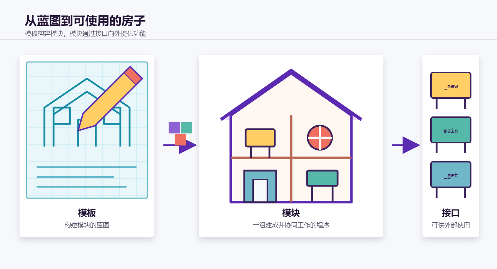
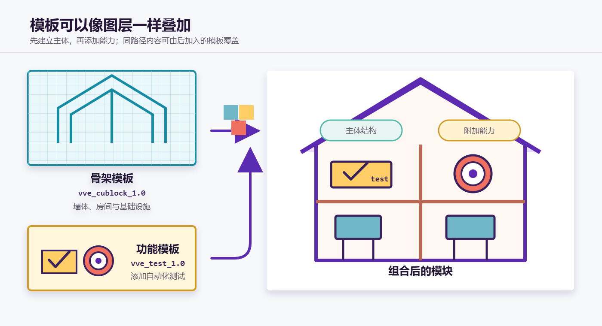
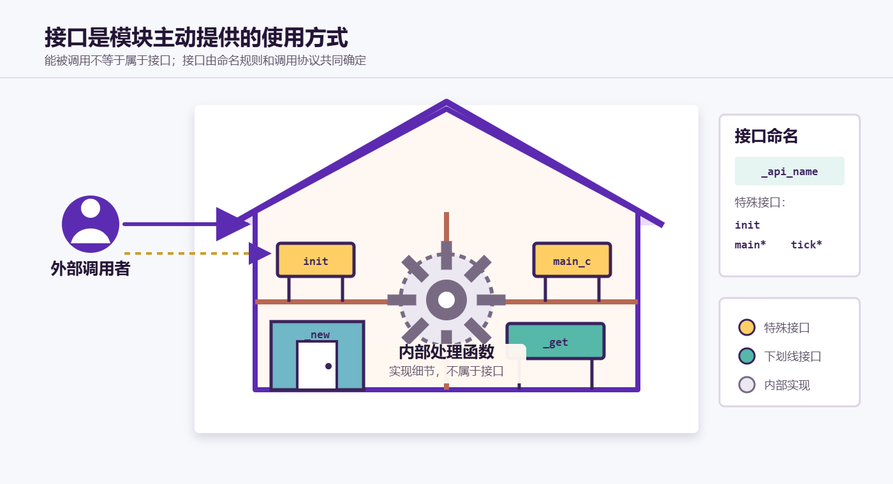

# 模板、模块与接口

模板、模块与接口是 VVE 组织代码时最基础的三个概念。可以把开发一个模块想象成建造一栋房子：

- **模板**是建造房子的蓝图；
- **模块**是根据蓝图建成的房子；
- **接口**是房子中可供人使用的门、桌椅和其他功能家具。



这个类比不仅用于帮助理解，也准确描述了三者之间的关系：模板负责构建，模块负责承载功能，接口负责让外部使用这些功能。

## 1. 模板

模板是一个完整的、带版本号的 MOT 预设包，例如：

```text
memory_storage/vve_cublock_1.0/
├─ objects/
│  ├─ global_settings.mcfo
│  └─ vars_dict.mcfo
└─ templates/
   ├─ init.mcfi
   ├─ _new.mcfi
   ├─ _get.mcfi
   ├─ main.mcfi
   └─ ...
```

其中：

- `templates/` 保存待构建的函数模板；
- `objects/` 保存对象格式构建所需的配置；
- 目录名中的版本号用于区分模板版本。

单个 `.mcfi` 文件只是模板包的一部分。本文所说的“模板”，指包含这些文件和配置的整个预设包，而不是其中某一个文件。

### 1.1 模板参数

函数模板中可以使用 MOT 提供的模块参数：

| 参数 | 含义 | 示例值 |
| --- | --- | --- |
| `$(module_prefix)` | 模块的完整函数前缀 | `vve_examples:dice_6_s/` |
| `$(project_name)` | 模块所在的命名空间 | `vve_examples` |
| `$(module_name)` | 模块名 | `dice_6_s` |

例如，模板中的：

```mcfunction
function $(module_prefix)_class
```

构建到 `dice_6_s` 模块后会成为：

```mcfunction
function vve_examples:dice_6_s/_class
```

除了替换模块参数，MOT 还会展开 `$init`、`$create`、`$assign` 等构建指令，生成记分板初始化、对象赋值和数据转换代码。

### 1.2 骨架模板与功能模板

模板可以承担不同规模的构建任务。

**骨架模板**负责建立模块的主体结构。例如 `vve_cublock_1.0` 会提供立方体刚体模块所需的数据结构、初始化程序、物理主程序和常用接口。它相当于画出了地基、墙体、房间和管线。

**功能模板**负责在已有模块上增加一组功能。例如 `vve_test_1.0` 只添加 `test/` 目录下的自动化测试程序，不会重新建造整个刚体模块。它相当于给房子增加测试设备。



### 1.3 模板的叠加与覆盖

MOT 记忆栈可以依次压入多个模板。后加入的模板可以：

- 添加原先不存在的文件；
- 补充新的功能目录；
- 用同路径文件覆盖此前模板提供的默认实现。

例如，先使用刚体骨架模板构建模块：

```text
push vve_cublock_1.0
run
init
sync
stop
pop
```

再压入自动化测试模板：

```text
push vve_test_1.0
run
init
sync
stop
pop
```

最终得到的是一个同时拥有刚体功能和自动化测试功能的模块。

这种关系更接近“图层叠加与局部覆盖”，而不是传统面向对象语言中的类继承。

### 1.4 模板与数据模板不是同一概念

需要区分以下两个术语：

| 术语 | 所处阶段 | 用途 |
| --- | --- | --- |
| 模板 | 数据包构建阶段 | 通过 MOT 生成模块代码 |
| 数据模板 | Minecraft 运行阶段 | 保存一类实例的初始数据，用于创建实例 |

例如，`vve_cublock_1.0` 是代码构建模板；而 `_class` 写入 `storage <namespace>:class <module_name>_plate` 的数据则是数据模板。

## 2. 模块

模块是围绕同一个函数路径前缀组织起来的一组实际程序。它可以由模板构建，也可以由作者直接编写。

例如：

```text
data/vve_examples/function/dice_6_s/
```

对应的模块函数前缀是：

```text
vve_examples:dice_6_s/
```

该目录下的 `init`、`_new`、`_get`、`main_c`、`tick` 等函数共同组成 `dice_6_s` 模块。

### 2.1 模块的职责

一个模块通常会负责以下部分中的一项或多项：

- 建立自身所需的记分板、storage 和常量；
- 定义临时对象或其他数据结构；
- 创建、读取、更新和销毁实例；
- 执行物理迭代或其他主程序；
- 向其他模块提供接口。

模块的边界由功能职责和函数前缀共同确定。位于同一命名空间并不代表属于同一个模块，例如 `vve:object/` 和 `vve:cublock/` 是两个不同的模块。

### 2.2 模块与模块实例

模块不是模块实例。

- **模块**是一组共享的程序和规则，例如 `vve_examples:dice_6_s/`；
- **模块实例**是模块在游戏中创建出的具体对象，例如某一个正在滚动的六面骰子实体。

同一个模块可以创建多个实例。它们调用同一组模块函数，但各自在实体记分板或 NBT 中保存自己的状态。

并非所有模块都必须创建实例。例如，一些工具模块只提供公共计算或数据管理功能。

## 3. 接口

接口是模块明确提供给外部调用的 API。它是房子中为使用者准备的功能家具，而不是藏在墙体中的线路或施工工具。

因此，**一个函数在技术上能够被其他函数调用，并不意味着它属于接口**。只有符合模块接口约定的函数，才是模块承诺对外提供的功能。



### 3.1 接口命名规则

VVE 使用函数名区分外部接口和内部处理函数。

| 函数类型 | 命名规则 | 是否属于接口 |
| --- | --- | --- |
| 普通外部 API | 以下划线 `_` 开头 | 是 |
| 初始化接口 | `init` | 是 |
| 主程序接口 | 以 `main` 开头 | 是 |
| 调度接口 | 以 `tick` 开头 | 是 |
| 其他内部处理函数 | 不符合以上规则 | 否 |

常见接口包括：

| 接口 | 作用 |
| --- | --- |
| `init` | 初始化模块 |
| `_class` | 构建模块的默认数据模板 |
| `_consts` | 设置模块常量 |
| `_new` | 根据输入数据创建模块实例 |
| `_del` | 销毁模块实例 |
| `_get` | 将实例数据读取到临时对象 |
| `_store` | 将临时对象写回实例 |
| `main*` | 执行某一类模块主程序 |
| `tick*` | 按指定方式调度实例运行 |

`set`、`set_operation`、`response` 等不以下划线开头、也不属于 `init`、`main*`、`tick*` 的函数，是模块内部实现，不属于接口。

### 3.2 接口不仅是函数名

一个完整的接口约定还应说明：

- 调用时的执行者；
- 调用位置和朝向；
- 输入的记分板、storage 或宏参数；
- 输出的记分板、storage 或实体；
- 会占用或修改的临时数据；
- 调用产生的副作用。

例如 `_new` 接口的典型约定是：

```text
输入：storage <namespace>:io input 中的数据模板
输入：当前执行位置
输出：@e[tag=result,limit=1]
```

调用者只有同时遵守路径和数据协议，才算正确使用了这个接口。

### 3.3 直接调用与动态调用

已知模块前缀时，可以直接调用模块接口：

```mcfunction
function vve_examples:dice_6_s/_new
```

当调用者只持有一个模块实例、不知道它属于哪个具体模块时，可以通过 `module_control` 动态调用接口。

支持动态调用的模块会在 `init` 中注册自身前缀，并把获得的 `module_id` 写入实例。`module_control:_call_method` 根据实例的 `module_id` 找回模块前缀，再将其与接口路径组合：

```mcfunction
execute as @e[tag=target] run function module_control:_call_method {path:"_say"}
```

这样，不同模块的实例可以响应同一次调用，并分别执行自己的实现。

动态调用模块的注册与写入实例，可以参考:
```
#vve_examples:impulse_lamp/init
#vve_examples:impulse_lamp/set_operation
```

动态调用只是接口的一种调用方式。接口是否成立，仍然取决于模块是否将该函数作为外部 API 提供。

## 4. 三者如何协作

一个典型的开发流程如下：

1. 选择一个骨架模板，确定模块的基本结构。
2. 根据需要叠加功能模板，并覆盖需要定制的默认内容。
3. 使用 MOT 将模板展开为具体模块。
4. 在模块内部实现功能，并通过接口向外暴露稳定的使用方式。
5. 其他程序只依赖接口，不依赖模块内部处理细节。

以 `dice_6_s` 为例：

1. `vve_cublock_1.0` 提供立方体刚体模块的骨架；
2. 作者修改 `_class`、`_new`、`set_operation` 等内容，使其成为六面骰子；
3. `vve_test_1.0` 为模块补充自动化测试；
4. 最终生成 `vve_examples:dice_6_s/` 模块；
5. 外部程序通过 `_new`、`_del`、`main*`、`tick*` 等接口使用该模块。

## 5. 概念总结

| 概念 | 房屋类比 | 项目中的含义 |
| --- | --- | --- |
| 模板 | 蓝图 | 可叠加、可覆盖的 MOT 预设包 |
| 模块 | 房子 | 共享同一函数前缀、共同完成一项职责的程序集合 |
| 接口 | 功能家具 | 模块明确提供给外部调用的 API |
| 内部函数 | 墙内线路 | 模块的实现细节，不属于对外承诺 |
| 模块实例 | 一栋房子的具体使用现场 | 模块在游戏中创建并维护的具体对象 |

理解这三个概念后，可以把大型数据包拆成边界明确的模块，用模板减少重复构建工作，再通过稳定接口组织模块之间的协作。
