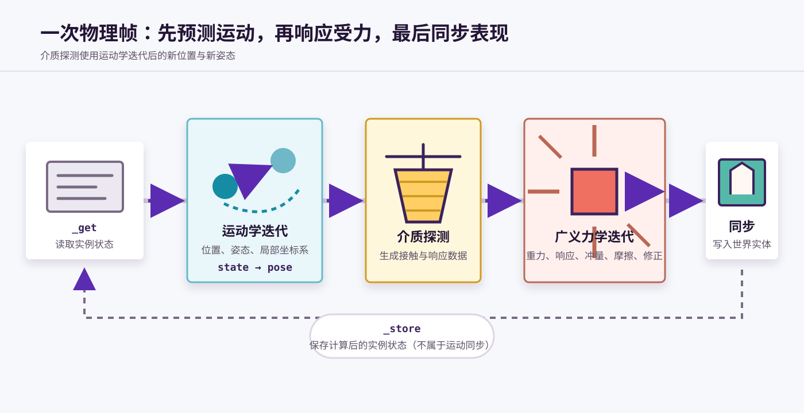
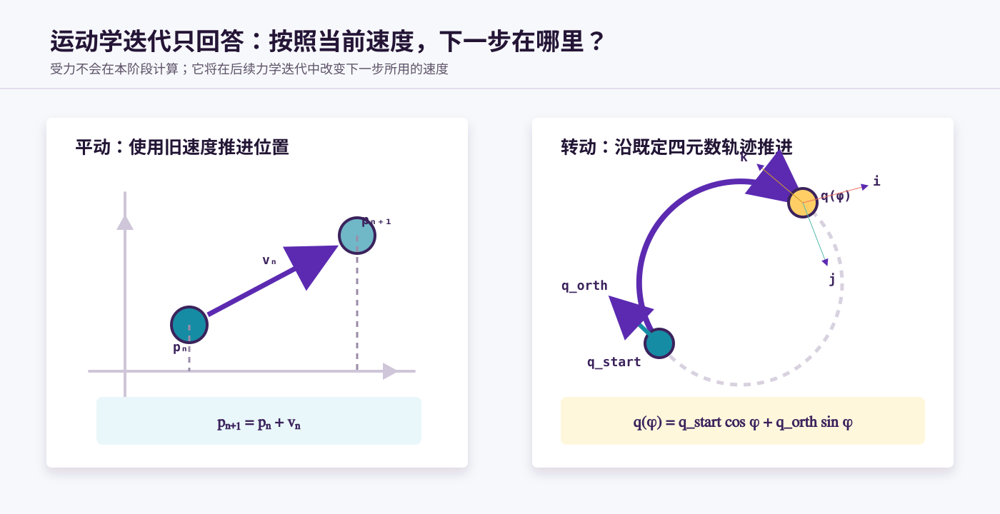
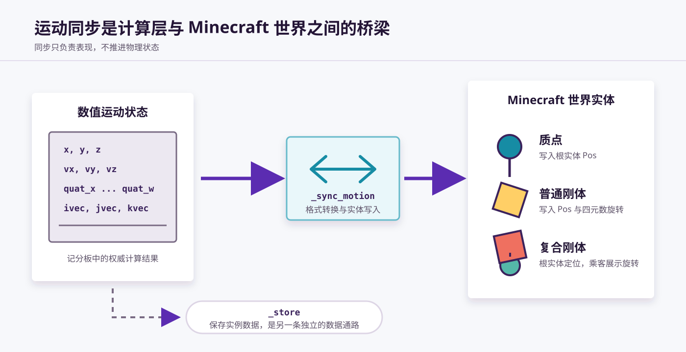

# 运动学迭代、力学迭代与运动同步

VVE 将一次物理帧拆分为三个主要阶段：

1. **运动学迭代**：根据当前速度和角速度推进位置与姿态；
2. **力学迭代**：根据重力、介质响应、冲量和摩擦等因素修改运动状态；
3. **运动同步**：把计算结果写入 Minecraft 世界中的实体。



三个阶段分别回答三个问题：

| 阶段 | 回答的问题 | 主要输出 |
| --- | --- | --- |
| 运动学迭代 | 按照当前运动状态，物体下一步在哪里？ | 新位置、新姿态、新局部坐标系 |
| 力学迭代 | 当前环境会怎样改变物体之后的运动？ | 新速度、新角速度以及必要的位置修正 |
| 运动同步 | 如何让 Minecraft 实体表现出计算结果？ | 实体位置、展示实体变换及插值状态 |

## 1. 一次物理帧的数据流

物理计算通常不会直接在 Minecraft 实体的 `Pos` 或 `transformation` 上进行，而是先把模块实例的数据读取到临时对象：

```text
模块实例
   ↓ _get
临时对象
   ↓ 运动学迭代
预测后的临时对象
   ↓ 介质探测
介质响应数据
   ↓ 广义力学迭代
计算完成的临时对象
   ├─ _sync_motion → Minecraft 世界实体
   └─ _store       → 模块实例
```

在这个过程中：

- `_get` 和 `_store` 负责模块实例与临时对象之间的数据搬运；
- 运动学迭代和力学迭代负责更新数值运动状态；
- `_sync_motion` 负责更新世界实体的实际表现。

运动同步不包括 `_store`。二者虽然都发生在一次物理帧的末尾，但同步目标并不相同。

## 2. 运动学迭代

运动学迭代只根据已有的运动状态推进物体，不计算产生这些运动的原因。

### 2.1 质点的平动迭代

质点只需要更新位置。默认时间步下，`vve:point/_iter_motion` 执行：

```text
x ← x + vx
y ← y + vy
z ← z + vz
```

写成离散形式就是：

```text
p(n + 1) = p(n) + v(n)
```

其中 `p` 表示位置，`v` 表示线速度。位置使用本次迭代开始时已有的速度推进。

### 2.2 刚体的平动与转动迭代

刚体首先以相同方式更新质心位置，然后根据角速度推进姿态。

VVE 使用以下数据描述一段角速度不变的旋转过程：

| 数据 | 含义 |
| --- | --- |
| `quat_start` | 本段旋转开始时的姿态 |
| `quat_orth` | 与旋转轨迹对应的正交四元数 |
| `quat_phi` | 当前旋转相位 |
| `angular_len` | 每次迭代增加的旋转相位 |

每次运动学迭代先推进相位：

```text
quat_phi ← quat_phi + angular_len
```

然后重建当前姿态：

```text
q(φ) = quat_start · cos(φ) + quat_orth · sin(φ)
```

当角速度保持不变时，物体会沿这条既定的四元数轨迹继续旋转。当力学迭代改变角速度时，`vve:object/_set_angular` 会：

1. 单位化当前四元数；
2. 根据角速度计算旋转轴和模长；
3. 把当前姿态保存为新的 `quat_start`；
4. 重新计算 `quat_orth`；
5. 将 `quat_phi` 重置为 `0`。

这样，下一次运动学迭代会从当前姿态沿新的旋转轴继续运动，而不会产生姿态跳变。



### 2.3 局部坐标系更新

刚体得到新的四元数后，还会将它转换为三个局部坐标轴：

```text
ivec：局部 u 轴
jvec：局部 v 轴
kvec：局部 w 轴
```

介质探测、碰撞点计算、局部力与模型显示都可能访问这套局部坐标系。因此，姿态和局部坐标系必须在介质探测之前完成更新。

### 2.4 运动学迭代不做什么

运动学迭代不会：

- 施加重力；
- 计算介质响应；
- 处理冲量或力偶矩；
- 应用摩擦；
- 修正碰撞穿透；
- 将结果写入世界实体。

这些工作分别属于力学迭代和运动同步。

## 3. 介质探测的位置

介质探测位于运动学迭代和力学迭代之间：

```text
运动学迭代 → 介质探测 → 力学迭代
```

这样设计的原因是：介质探测需要使用物体推进后的新位置、新姿态和新局部坐标系，判断碰撞点进入了哪些介质，以及产生了怎样的接触关系。

介质探测本身主要负责生成响应数据，例如：

- 位移修正量；
- 冲量及其作用点；
- 力偶矩；
- 摩擦系数；
- 接触面法向量；
- 是否需要进行着陆姿态修正。

这些数据随后由广义力学迭代应用到物体状态。介质探测与介质响应的具体协议将在[介质探测与介质响应](介质探测,%20介质响应.md)中介绍。

## 4. 广义力学迭代

本文所说的“力学迭代”采用广义定义，包括介质响应、外部冲量、摩擦和姿态修正，而不仅是重力加速。

### 4.1 力学迭代修改什么

广义力学迭代可以修改三类状态：

| 状态 | 常见来源 |
| --- | --- |
| 位置 `x/y/z` | 碰撞穿透产生的位移修正 |
| 线速度 `vx/vy/vz` | 重力、冲量、外力、摩擦 |
| 角速度 `angular_x/y/z` | 偏心冲量、力偶矩、摩擦、姿态修正 |

不同模块可以根据物理模型选择不同的响应组合，但典型刚体会依次处理以下内容。

### 4.2 重力

重力直接改变竖直速度：

```mcfunction
scoreboard players operation vy int -= vve_gravity int
```

这里不展开 `vve_gravity` 的单位和时间倍率。相关换算由“常量表、模拟器”和“运动慢放、运动拆解”文档说明。

### 4.3 位移响应

当物体已经进入不可穿透区域时，介质模型可以给出 `shift`，直接修正位置：

```text
p ← p + shift
```

位移响应主要用于消除穿透。它修改的是位置，而不是速度。

### 4.4 冲量响应

冲量会改变线速度：

```text
Δv = J / m
```

其中 `J` 是冲量，`m` 是质量。

当冲量作用点不经过质心时，还会产生角速度变化。`vve:object/_apply_impulse` 会先计算作用点相对质心的位矢，再通过叉乘得到旋转效应：

```text
Δω ∝ (r × J) / I
```

其中 `r` 是冲量作用点相对质心的位矢，`I` 是当前模型使用的惯量。

某些模型会将平动冲量与旋转响应分开计算，例如先用 `_apply_impulse_f` 更新线速度，再用 `_apply_couple` 应用力偶矩。

### 4.5 外部冲量

除了介质碰撞产生的响应，物体还可以接收其他实例或外部程序传入的冲量。模块会汇总这些输入，再将其应用到当前临时对象。

外部冲量和介质冲量最终都会修改线速度或角速度，但它们的数据来源不同。

### 4.6 摩擦

摩擦响应通过摩擦系数缩放线速度和角速度，使物体逐渐损失动能。

不同介质可以提供不同的摩擦系数。多个碰撞点产生响应时，模块会先汇总介质响应，再统一应用摩擦。

### 4.7 姿态与角速度修正

物体稳定接触表面且速度足够低时，可以执行姿态修正：

- 根据接触面法向量规整姿态；
- 消除不需要的法向角速度；
- 重新建立后续旋转所需的四元数轨迹。

这使载具或刚体可以稳定着陆，而不是在接触面上持续产生微小翻滚。

### 4.8 显式欧拉更新顺序

VVE 的默认迭代顺序可以概括为：

```text
p(n + 1) = p(n) + v(n)
v(n + 1) = v(n) + Δv(n)
```

即：

1. 使用旧速度推进位置；
2. 在推进后的状态上进行介质探测；
3. 根据受力和介质响应计算新速度；
4. 新速度供下一次运动学迭代使用。

这是显式欧拉法在 VVE 物理流程中的表现。碰撞产生的位移修正会在本次力学迭代中额外调整已经推进的位置。

## 5. 运动同步

运动学和力学迭代修改的是 VVE 的数值状态。运动同步负责把这些结果转换成 Minecraft 实体能够表现的数据。



### 5.1 为什么需要运动同步

记分板中的 `x/y/z`、四元数和局部坐标轴是物理计算的权威状态，但 Minecraft 不会自动读取这些记分板来移动实体。

因此，物理计算结束后必须显式地：

- 将定点数坐标转换为实体 `Pos`；
- 将四元数转换为展示实体的 `transformation.left_rotation`；
- 写入模型需要的额外平移或偏移；
- 在适当时机启动展示实体插值。

运动同步只投影已有结果，不会计算下一步位置，也不会施加新的力。

### 5.2 不同模型的同步方案

不同的实体结构需要不同的同步方式。

| 模型 | 典型同步方式 |
| --- | --- |
| 质点 | 将 `x/y/z` 写入根实体 `Pos` |
| 普通刚体 | 将位置和四元数写入同一个展示实体 |
| `cublock` / `cubox` | 根实体负责定位，乘客展示实体负责旋转 |
| 特殊模型 | 在基础位置和旋转之外加入模型平移、中心偏移或摄像机同步 |

例如 `cublock` 会把四元数写入乘客展示实体，同时根据 `cube_shift_y` 调整根实体位置。这样可以将物理质心、交互实体位置和显示模型中心分开处理。

### 5.3 展示实体插值

运动同步会比较实例此前保存的四元数与当前计算出的四元数。

- 姿态发生变化时，写入 `start_interpolation: 0`，启动新的变换插值；
- 姿态没有变化时，不重复启动姿态插值。

这样可以在保持显示平滑的同时，避免静止物体反复重置插值状态。

### 5.4 运动同步与 `_store`

运动同步和 `_store` 是两条独立的数据通路：

```text
临时对象 ── _sync_motion ──→ 世界实体的 Pos / transformation

临时对象 ── _store ────────→ 模块实例的记分板 / NBT
```

运动同步关心“玩家看到什么”，`_store` 关心“下一次计算从什么状态继续”。

## 6. 三个阶段可以分离

普通主程序通常在一次调用中依次完成运动学迭代、力学迭代和运动同步，但三个阶段并不必须绑定在一起。

模块可以提供不同的主程序接口：

| 接口 | 职责 |
| --- | --- |
| `main*` | 完整运行或运行某一种组合流程 |
| `main_slow_mov` | 只推进拆分后的运动学步骤 |
| `main_slow_key` | 处理慢放关键步和整数余数 |
| `main_force` | 只运行介质探测与广义力学迭代 |
| `main_sync` | 只运行运动同步 |
| `tick*` | 选择实例并调度相应主程序 |

拆分后，可以让物理迭代频率和世界实体同步频率相互独立。例如：

- 一个游戏刻内执行多次物理迭代，最后只同步一次；
- 将一次运动拆成多个游戏刻显示；
- 降低力学计算频率，但仍保持必要的画面同步。

本章只说明三个阶段可以分离。具体的时间倍率、关键步和余数补偿将在[运动慢放与运动拆解](运动慢放,%20运动拆解.md)中介绍。

## 7. 模块主程序的基本结构

一个刚体模块的完整主程序通常具有以下结构：

```mcfunction
# 读取实例状态
function <module_prefix>_get

# 运动学迭代
execute as 0-0-0-0-0 run function vve:object/_iter_motion

# 在新位置和姿态上进行介质探测
function <module_prefix>_iter_cpoints

# 广义力学迭代
scoreboard players operation vy int -= vve_gravity int
# 应用位移、冲量、力偶矩、摩擦和姿态修正

# 将计算结果投影到实例
function <sync_motion_function>

# 保存实例状态
function <module_prefix>_store
```

模块可以替换介质探测函数、力学响应组合或运动同步方案，但应保持各阶段的数据职责清晰。

## 8. 概念总结

| 概念 | 读取的主要状态 | 修改的主要状态 | 是否直接修改实例 |
| --- | --- | --- | --- |
| 运动学迭代 | 位置、速度、姿态、角速度 | 位置、姿态、局部坐标系 | 否 |
| 介质探测 | 新位置、新姿态、碰撞点 | 介质响应临时数据 | 否 |
| 广义力学迭代 | 速度、角速度、介质响应 | 位置修正、速度、角速度 | 否 |
| 运动同步 | 最终位置和姿态 | 实体 `Pos`、展示实体变换 | 是 |
| `_store` | 计算完成的临时对象 | 模块实例数据 | 否 |

把这几个阶段分开理解后，就能在不破坏整体流程的前提下，为模块替换碰撞方案、增加新的力学响应，或实现专用的实体同步方式。
